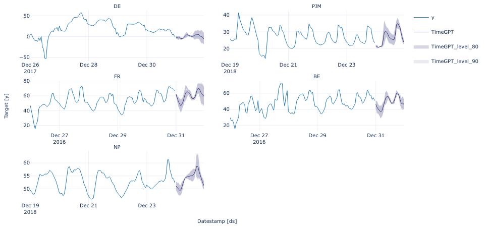
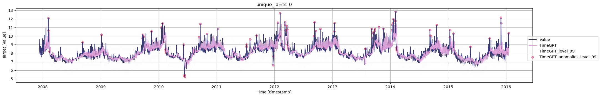
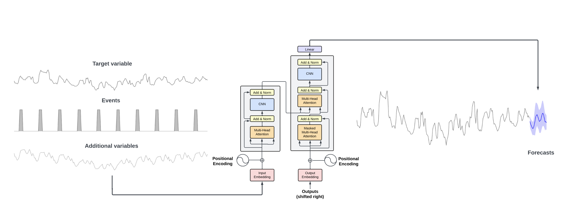
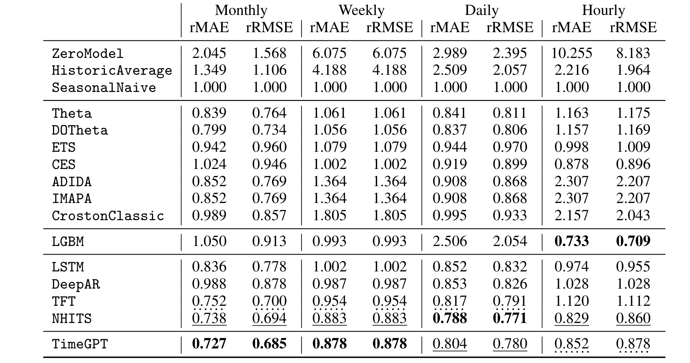

# Nixtla &nbsp; [](https://twitter.com/intent/tweet?text=Statistical%20Forecasting%20Algorithms%20by%20Nixtla%20&url=https://github.com/Nixtla/neuralforecast&via=nixtlainc&hashtags=StatisticalModels,TimeSeries,Forecasting) &nbsp;[](https://join.slack.com/t/nixtlacommunity/shared_invite/zt-1pmhan9j5-F54XR20edHk0UtYAPcW4KQ)

<div align="center">

<h1 align="center">TimeGPT-1 </h1>
<h3 align="center">The first foundation model for forecasting and anomaly detection</h3>

[](https://github.com/Nixtla/nixtla/actions/workflows/ci.yaml)
[](https://pypi.org/project/nixtla/)
[](https://github.com/Nixtla/nixtla/blob/main/LICENSE)
[](https://docs.nixtla.io)
[](https://pepy.tech/project/nixtla)
[](https://pepy.tech/project/nixtla)
[](https://pepy.tech/project/nixtla)

**TimeGPT** is a production ready, generative pretrained transformer for time series. It's capable of accurately predicting various domains such as retail, electricity, finance, and IoT with just a few lines of code 🚀.

</div>

## 🚀 Quick Start

https://github.com/Nixtla/nixtla/assets/4086186/163ad9e6-7a16-44e1-b2e9-dab8a0b7b6b6

### Install nixtla's SDK

```python
pip install nixtla>=0.7.0
```

### Import libraries and load data

```python
import pandas as pd
from nixtla import NixtlaClient
```

### Forecast using TimeGPT in 3 easy steps

```python
# Get your API Key at dashboard.nixtla.io

# 1. Instantiate the NixtlaClient
nixtla_client = NixtlaClient(api_key = 'YOUR API KEY HERE')

# 2. Read historic electricity demand data
df = pd.read_csv('https://raw.githubusercontent.com/Nixtla/transfer-learning-time-series/main/datasets/electricity-short.csv')

# 3. Forecast the next 24 hours
fcst_df = nixtla_client.forecast(df, h=24, level=[80, 90])

# 4. Plot your results (optional)
nixtla_client.plot(df, fcst_df, level=[80, 90])

```



### Anomaly detection using TimeGPT in 3 easy steps

```python
# Get your API Key at dashboard.nixtla.io

# 1. Instantiate the NixtlaClient
nixtla_client = NixtlaClient(api_key = 'YOUR API KEY HERE')

# 2. Read Data # Wikipedia visits of NFL Star (
df = pd.read_csv('https://datasets-nixtla.s3.amazonaws.com/peyton-manning.csv')


# 3. Detect Anomalies
anomalies_df = nixtla_client.detect_anomalies(df, time_col='timestamp', target_col='value', freq='D')

# 4. Plot your results (optional)
nixtla_client.plot(df, anomalies_df,time_col='timestamp', target_col='value')
```



## 🤓 API support for other languages

Explore our [API Reference](https://docs.nixtla.io) to discover how to leverage TimeGPT across various programming languages including JavaScript, Go, and more.

## ❄️ Snowflake Deployment

Run TimeGPT directly within your Snowflake environment. The deployment script creates stored procedures and UDTFs that enable forecasting and anomaly detection on your Snowflake data without moving it outside your infrastructure.

```bash
pip install nixtla[snowflake]
python -m nixtla.scripts.snowflake_install_nixtla
```

The script will guide you through setting up external access integrations, configuring your API key, and deploying the forecasting components to your specified database and schema.

## 🔥 Features and Capabilities

- **Zero-shot Inference**: TimeGPT can generate forecasts and detect anomalies straight out of the box, requiring no prior training data. This allows for immediate deployment and quick insights from any time series data.

- **Fine-tuning**: Enhance TimeGPT's capabilities by fine-tuning the model on your specific datasets, enabling the model to adapt to the nuances of your unique time series data and improving performance on tailored tasks.

- **API Access**: Integrate TimeGPT seamlessly into your applications via our robust API. Upcoming support for Azure Studio will provide even more flexible integration options. Alternatively, deploy TimeGPT on your own infrastructure to maintain full control over your data and workflows.

- **Add Exogenous Variables**: Incorporate additional variables that might influence your predictions to enhance forecast accuracy. (E.g. Special Dates, events or prices)

- **Multiple Series Forecasting**: Simultaneously forecast multiple time series data, optimizing workflows and resources.

- **Custom Loss Function**: Tailor the fine-tuning process with a custom loss function to meet specific performance metrics.

- **Cross Validation**: Implement out of the box cross-validation techniques to ensure model robustness and generalizability.

- **Prediction Intervals**: Provide intervals in your predictions to quantify uncertainty effectively.

- **Irregular Timestamps**: Handle data with irregular timestamps, accommodating non-uniform interval series without preprocessing.

## 📚 Documentation with examples and use cases

Dive into our [comprehensive documentation](https://docs.nixtla.io/docs/getting-started-timegpt_quickstart) to discover examples and practical use cases for TimeGPT. Our documentation covers a wide range of topics, including:

- **Getting Started**: Begin with our user-friendly [Quickstart Guide](https://docs.nixtla.io/docs/getting-started-timegpt_quickstart) and learn how to [set up your API key](https://docs.nixtla.io/docs/getting-started-setting_up_your_api_key) effortlessly.

- **Advanced Techniques**: Master advanced forecasting methods and learn how to enhance model accuracy with our tutorials on [anomaly detection](https://docs.nixtla.io/docs/tutorials-anomaly_detection), fine-tuning models using specific loss functions, and scaling computations across distributed frameworks such as [Spark, Dask, and Ray](https://docs.nixtla.io/docs/tutorials-computing_at_scale).

- **Specialized Topics**: Explore specialized topics like [handling exogenous variables](https://docs.nixtla.io/docs/tutorials-holidays_and_special_dates), model validation through [cross-validation](https://docs.nixtla.io/docs/tutorials-cross_validation), and strategies for [forecasting under uncertainty](https://docs.nixtla.io/docs/tutorials-uncertainty_quantification).

- **Real World Applications**: Uncover how TimeGPT is applied in real-world scenarios through case studies on [forecasting web traffic](https://docs.nixtla.io/docs/use-cases-forecasting_web_traffic) and [predicting Bitcoin prices](https://docs.nixtla.io/docs/use-cases/bitcoin_price_prediction).

## 🗞️ TimeGPT1 Revolutionizing Forecasting and Anomaly Detection

Time series data is pivotal across various sectors, including finance, healthcare, meteorology, and social sciences. Whether it's monitoring ocean tides or tracking the Dow Jones's daily closing values, time series data is crucial for forecasting and decision-making.

Traditional analysis methods such as ARIMA, ETS, MSTL, Theta, CES, machine learning models like XGBoost and LightGBM, and deep learning approaches have been standard tools for analysts. However, TimeGPT introduces a paradigm shift with its standout performance, efficiency, and simplicity. Thanks to its zero-shot inference capability, TimeGPT streamlines the analytical process, making it accessible even to users with minimal coding experience.

TimeGPT is user-friendly and low-code, enabling users to upload their time series data and either generate forecasts or detect anomalies with just a single line of code. As the only foundation model for time series analysis out of the box, TimeGPT can be integrated via our public APIs, through Azure Studio (coming soon), or deployed on your own infrastructure.

## ⚙️ TimeGPT's Architecture

Self-attention, the revolutionary concept introduced by the paper “Attention is all you need“, is the basis of the this foundational model. The TimeGPT model is not based on any existing large language model(LLMs). It is independently trained on vast timeseries dataset as a large transformer model and is designed so as to minimize the forecasting error.

The architecture consists of an encoder-decoder structure with
multiple layers, each with residual connections and layer normalization. Finally, a linear layer maps the decoder’s output to the forecasting window dimension. The general intuition is that attentionbased mechanisms are able to capture the diversity of past events and correctly extrapolate potential
future distributions.



TimeGPT was trained on, to our knowledge, the largest collection of publicly available time series,
collectively encompassing over 100 billion data points. This training set incorporates time series
from a broad array of domains, including finance, economics, demographics, healthcare, weather,
IoT sensor data, energy, web traffic, sales, transport, and banking. Due to this diverse set of domains,
the training dataset contains time series with a wide range of characteristics

---

## ⚡️ Zero-shot Results

### Accuracy

TimeGPT has been tested for its zero-shot inference capabilities on more than 300K unique series, which involve using the model without additional fine-tuning on the test dataset. TimeGPT outperforms a comprehensive range of well-established statistical and cutting-edge deep learning models, consistently ranking among the top three performers across various frequencies.

### Ease of use

TimeGPT also excels by offering simple and rapid predictions using a pre-trained model. This stands in stark contrast to other models that typically require an extensive training and prediction pipeline.



### Efficiency and Speed

For zero-shot inference, our internal tests recorded an average GPU inference speed of 0.6 milliseconds per series for TimeGPT, which nearly mirrors that of the simple Seasonal Naive.

## 📝 How to cite?

If you find TimeGPT useful for your research, please consider citing the associated [paper](https://arxiv.org/abs/2310.03589):

```
@misc{garza2023timegpt1,
      title={TimeGPT-1},
      author={Azul Garza and Max Mergenthaler-Canseco},
      year={2023},
      eprint={2310.03589},
      archivePrefix={arXiv},
      primaryClass={cs.LG}
}
```

## 🎉 Features and Mentions

TimeGPT has been featured in many publications and has been recognized for its innovative approach to time series forecasting. Here are some of the features and mentions:

- [TimeGPT Revolutionizing Time Series Forecasting](https://www.analyticsvidhya.com/blog/2024/02/timegpt-revolutionizing-time-series-forecasting/)
- [TimeGPT: The First Foundation Model for Time Series Forecasting](https://towardsdatascience.com/timegpt-the-first-foundation-model-for-time-series-forecasting-bf0a75e63b3a)
- [TimeGPT: Revolutionising Time Series Forecasting with Generative Models](https://medium.com/@22meera99/timegpt-revolutionising-time-series-forecasting-with-generative-models-86be6c09fa51)
- [TimeGPT on Turing Post](https://www.turingpost.com/p/timegpt)
- [TimeGPT Presentation at AWS Events](https://www.youtube.com/watch?v=5pYkT0rTCfE&ab_channel=AWSEvents)
- [TimeGPT: Machine Learning for Time Series Made Accessible - Podcast](https://podcasts.apple.com/bg/podcast/timegpt-machine-learning-for-time-series-made-accessible/id1487704458?i=1000638551991)
- [TimeGPT on The Data Exchange](https://thedataexchange.media/timegpt/)
- [How TimeGPT Transforms Predictive Analytics with AI](https://hackernoon.com/how-timegpt-transforms-predictive-analytics-with-ai)
- [TimeGPT: The First Foundation Model - AI Horizon Forecast](https://aihorizonforecast.substack.com/p/timegpt-the-first-foundation-model)

## 🔖 License

TimeGPT is closed source. However, this SDK is open source and available under the Apache 2.0 License. Feel free to contribute (check out the [Contributing](https://github.com/Nixtla/nixtla/blob/main/CONTRIBUTING.md) guide for more details).

## 🏷️ Attribution

NixtlaClient may be used to access services powered by technology from Google, Amazon, IBM, Datadog, and NXAI. All trademarks are the property of their respective owners.

## 📞 Get in touch

For any questions or feedback, please feel free to reach out to us at ops [at] nixtla.io.
