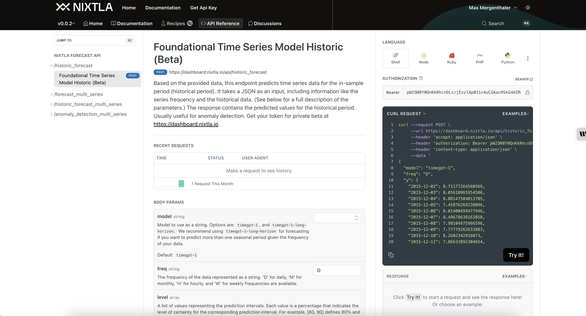

# Nixtla &nbsp; [](https://twitter.com/intent/tweet?text=Statistical%20Forecasting%20Algorithms%20by%20Nixtla%20&url=https://github.com/Nixtla/neuralforecast&via=nixtlainc&hashtags=StatisticalModels,TimeSeries,Forecasting) &nbsp;[](https://join.slack.com/t/nixtlacommunity/shared_invite/zt-1pmhan9j5-F54XR20edHk0UtYAPcW4KQ)

<div align="center">

<h1 align="center">TimeGPT-1 </h1>
<h3 align="center">The first foundation model for forecasting and anomaly detection</h3>

[](https://github.com/Nixtla/nixtla/actions/workflows/ci.yaml)
[](https://pypi.org/project/nixtla/)
[](https://github.com/Nixtla/nixtla/blob/main/LICENSE)
[](https://nixtlaverse.nixtla.io/nixtla/)
[](https://pepy.tech/project/nixtla)
[](https://pepy.tech/project/nixtla)
[](https://pepy.tech/project/nixtla)

**TimeGPT** is a production ready, generative pretrained transformer for time series. It's capable of accurately predicting various domains such as retail, electricity, finance, and IoT with just a few lines of code 🚀. 
</div>


## 🚀 Quick Start

https://github.com/Nixtla/nixtla/assets/4086186/163ad9e6-7a16-44e1-b2e9-dab8a0b7b6b6


### Install nixtla's SDK
```python
pip install nixtla>=0.5.0
```

### Import libraries and load dara
``` python
import pandas as pd
from nixtla import NixtlaClient
```
###  Forecast using TimeGPT in 3 easy steps
```python
# 1. Instantiate the NixtlaClient
# Get your API Key at dashboard.nixtla.io

nixtla_client = NixtlaClient(
    api_key = 'YOUR API KEY HERE'
)

# 2. Read Data # Historic Air Passenger Data (
df = pd.read_csv('https://raw.githubusercontent.com/Nixtla/transfer-learning-time-series/main/datasets/air_passengers.csv')


# 3. Forecast the next 24 months
timegpt_fcst_df = nixtla_client.forecast(df=df, # data (can be dataframe with multiple ids)
                                         h=24, # Forecast horizon
                                         time_col='timestamp',
                                         target_col='value',
                                         level=[80, 90], # Prediction intervals
                                         model='timegpt-1-long-horizon')


# 4. Plot your results (optional)
nixtla_client.plot(df, timegpt_fcst_df, time_col='timestamp', target_col='value', level=[80, 90])

```

###  Anomaly detection using TimeGPT in 3 easy steps
```python
# 1. Instantiate the NixtlaClient
# Get your API Key at dashboard.nixtla.io

nixtla_client = NixtlaClient(
    api_key = 'YOUR API KEY HERE'
)

# 2. Read Data # Wikipedia visits of NFL Star (
df = pd.read_csv('https://raw.githubusercontent.com/Nixtla/transfer-learning-time-series/main/datasets/peyton_manning.csv')


# 3. Detect Anomalies 
anomalies_df = nixtla_client.detect_anomalies(df, time_col='timestamp', target_col='value', freq='D'
)

# 4. Plot your results (optional)
nixtla_client.plot(df, anomalies_df,time_col='timestamp', target_col='value'
)
```

## 🤓 API support for other languages
Go to  our [API Reference](https://docs.nixtla.io) to see how to use TimeGPT with other languages like JavaScript, Go and more.




## 🔥 Features and Capabilities

- **Zero-shot Inference**: TimeGPT can generate forecasts and detect anomalies straight out of the box, requiring no prior training data. This allows for immediate deployment and quick insights from any time series data.
  
- **Fine-tuning**: Enhance TimeGPT's capabilities by fine-tuning the model on your specific datasets, enabling the model to adapt to the nuances of your unique time series data and improving performance on tailored tasks.

- **API Access**: Integrate TimeGPT seamlessly into your applications via our robust API. Upcoming support for Azure Studio will provide even more flexible integration options. Alternatively, deploy TimeGPT on your own infrastructure to maintain full control over your data and workflows.
  
- **Add Exogenous Variables**: Incorporate additional variables that might influence your predictions to enhance forecast accuracy. (E.g. Special Dates, events or prices)
  
- **Multiple Series Forecasting**: Simultaneously forecast multiple time series data, optimizing workflows and resources.
  
- **Custom Loss Function**: Tailor the fine-tuning process with a custom loss function to meet specific performance metrics.

- **Cross Validation**: Implement out of the box cross-validation techniques to ensure model robustness and generalizability.

- **Prediction Intervals**: Provide intervals in your predictions to quantify uncertainty effectively.
  
- **Irregular Timestamps**: Handle data with irregular timestamps, accommodating non-uniform interval series without preprocessing.

## 📚 Explore Examples and Use Cases

Dive into our [comprehensive documentation](https://docs.nixtla.io/docs/getting-started-timegpt_quickstart) to discover a plethora of examples and practical use cases for TimeGPT. Our resources cater to all skill levels and are structured to guide you seamlessly through each aspect of our platform.

- **Getting Started**: Begin with our user-friendly [Quickstart Guide](https://docs.nixtla.io/docs/getting-started-timegpt_quickstart) and learn how to [set up your API key](https://docs.nixtla.io/docs/getting-started-setting_up_your_api_key) effortlessly.

- **Advanced Techniques**: Master advanced forecasting methods and learn how to enhance model accuracy with our tutorials on [anomaly detection](https://docs.nixtla.io/docs/tutorials-anomaly_detection), fine-tuning models using specific loss functions, and scaling computations across distributed frameworks such as [Spark, Dask, and Ray](https://docs.nixtla.io/docs/tutorials-computing_at_scale).

- **Specialized Topics**: Explore specialized topics like [handling exogenous variables](https://docs.nixtla.io/docs/tutorials-holidays_and_special_dates), model validation through [cross-validation](https://docs.nixtla.io/docs/tutorials-cross_validation), and strategies for [forecasting under uncertainty](https://docs.nixtla.io/docs/tutorials-uncertainty_quantification).

- **Real-World Applications**: Uncover how TimeGPT is applied in real-world scenarios through case studies on [forecasting web traffic](https://docs.nixtla.io/docs/use-cases-forecasting_web_traffic) and [predicting Bitcoin prices](https://docs.nixtla.io/docs/use-cases-bitcoin_price_prediction).


## 🗞️ TimeGPT-1: Revolutionizing Forecasting and Anomaly Detection

Time series data is an essential component in various sectors, including finance, healthcare, meteorology, and social sciences. Whether it’s tracking ocean tides or monitoring the daily closing value of the Dow Jones, time series data plays an indispensable role in forecasting future values and informing decision-making processes.

Traditionally, analysts have relied on methods like ARIMA, ETS, MSTL, Theta, and CES, as well as machine learning models like XGBoost and LightGBM or deep learning models to analyze time series data. 

However, in comparison to established statistical, machine learning, and deep learning methods, TimeGPT stands out in terms of performance, efficiency, and simplicity through its zero-shot inference capability.

TimeGPT is user-friendly and low-code. Users can simply upload their time series data and generate forecasts or detect anonal ies for desired time steps with just a single line of code.

TimeGPT is the only out of the box foundational model for time series and be used through our public APIs, throgu Azure Studio (comming soon) or on your own infrastructure. 

Want to chat: send us an email to ops [at] nixtla.io. 

## ⚙️ Architecture
Self-attention, the revolutionary concept introduced by the paper “Attention is all you need“, is the basis of the this foundational model. The TimeGPT model is not based on any existing large language model(LLMs). It is independently trained on vast timeseries dataset as a large transformer model and is designed so as to minimize the forecasting error.

The architecture consists of an encoder-decoder structure with
multiple layers, each with residual connections and layer normalization. Finally, a linear layer maps the decoder’s output to the forecasting window dimension. The general intuition is that attentionbased mechanisms are able to capture the diversity of past events and correctly extrapolate potential
future distributions.


TimeGPT was trained on, to our knowledge, the largest collection of publicly available time series,
collectively encompassing over 100 billion data points. This training set incorporates time series
from a broad array of domains, including finance, economics, demographics, healthcare, weather,
IoT sensor data, energy, web traffic, sales, transport, and banking. Due to this diverse set of domains,
the training dataset contains time series with a wide range of characteristics

## ⚡️ Zero-shot Results
### Accuracy:
We first test TimeGPT capabilities on zero-shot inference, meaning that no additional fine-tuning is
performed on the test set. Table 1 presents the zero-shot results. Remarkably, TimeGPT outperforms
a comprehensive collection of battle-tested statistical models and SoTA deep learning approaches,
ranking among the top-3 performers across frequencies.
It must be noted that the validity of a forecasting model can only be assessed relative to its performance
against competing alternatives. Although accuracy is commonly seen as the only relevant metric,
computational cost and implementation complexity are key factors for practical applications. In this
regard, it is noteworthy that the reported results of TimeGPT are the result of a simple and extremely
fast invocation of the prediction method of a pre-trained model. In comparison, other models require
a complete pipeline for training and then predicting.


### Efficiency and Speed: 
For zero-shot inference, our internal tests recorded an average GPU inference speed of 0.6 milliseconds per series for TimeGPT, which nearly mirrors that of the simple Seasonal Naive. 

## 📝 How to cite?

If you find TimeGPT useful for your research, please consider citing the associated [paper](https://arxiv.org/abs/2310.03589):

```
@article{ansari2024chronos,
@misc{garza2023timegpt1,
      title={TimeGPT-1}, 
      author={Azul Garza and Max Mergenthaler-Canseco},
      year={2023},
      eprint={2310.03589},
      archivePrefix={arXiv},
      primaryClass={cs.LG}
}
```

## 🎉 Features and Mentions
TimeGPT has been featured in many publications and has been recognized for its innovative approach to time series forecasting. Here are some of the features and mentions:

- [TimeGPT Revolutionizing Time Series Forecasting](https://www.analyticsvidhya.com/blog/2024/02/timegpt-revolutionizing-time-series-forecasting/)
- [TimeGPT: The First Foundation Model for Time Series Forecasting](https://towardsdatascience.com/timegpt-the-first-foundation-model-for-time-series-forecasting-bf0a75e63b3a)
- [TimeGPT: Revolutionising Time Series Forecasting with Generative Models](https://medium.com/@22meera99/timegpt-revolutionising-time-series-forecasting-with-generative-models-86be6c09fa51)
- [TimeGPT on Turing Post](https://www.turingpost.com/p/timegpt)
- [TimeGPT Presentation at AWS Events](https://www.youtube.com/watch?v=5pYkT0rTCfE&ab_channel=AWSEvents)
- [TimeGPT: Machine Learning for Time Series Made Accessible - Podcast](https://podcasts.apple.com/bg/podcast/timegpt-machine-learning-for-time-series-made-accessible/id1487704458?i=1000638551991)
- [TimeGPT on The Data Exchange](https://thedataexchange.media/timegpt/)
- [How TimeGPT Transforms Predictive Analytics with AI](https://hackernoon.com/how-timegpt-transforms-predictive-analytics-with-ai)
- [TimeGPT: The First Foundation Model - AI Horizon Forecast](https://aihorizonforecast.substack.com/p/timegpt-the-first-foundation-model)


## 🔖 License
TimeGPT is closed source. However, this SDK is open source and available under the Apache 2.0 License. Feel free to contribute. 

## 📞 Get in touch
For any questions or feedback, please feel free to reach out to us at ops [at] nixtla.io.
