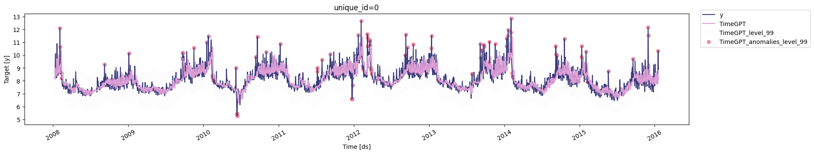

```python
!pip install -Uqq nixtla
```


```python
from nixtla.utils import in_colab
```


```python
IN_COLAB = in_colab()
```


```python
if not IN_COLAB:
    from nixtla.utils import colab_badge
    from dotenv import load_dotenv
```


To perform historical anomaly detection, use the `detect_anomalies`
method. Then, plot the anomalies using the `plot` method.

<figure>
<a
href="https://colab.research.google.com/github/Nixtla/nixtla/blob/main/nbs/docs/capabilities/anomaly-detection/01_quickstart.ipynb"></a>
</figure>

```python
import pandas as pd
from nixtla import NixtlaClient
```


```python
nixtla_client = NixtlaClient(
    # defaults to os.environ.get("NIXTLA_API_KEY")
    api_key = 'my_api_key_provided_by_nixtla'
)
```

> 👍 Use an Azure AI endpoint
>
> To use an Azure AI endpoint, set the `base_url` argument:
>
> `nixtla_client = NixtlaClient(base_url="you azure ai endpoint", api_key="your api_key")`


```python
if not IN_COLAB:
    nixtla_client = NixtlaClient()
```


```python
# Read the dataset
df = pd.read_csv('https://datasets-nixtla.s3.amazonaws.com/peyton-manning.csv')

# Detect anomalies
anomalies_df = nixtla_client.detect_anomalies(df, freq='D')

# Plot anomalies
nixtla_client.plot(df, anomalies_df)
```

``` text
INFO:nixtla.nixtla_client:Validating inputs...
INFO:nixtla.nixtla_client:Preprocessing dataframes...
INFO:nixtla.nixtla_client:Calling Anomaly Detector Endpoint...
```



> 📘 Available models in Azure AI
>
> If you use an Azure AI endpoint, set `model="azureai"`
>
> `nixtla_client.detect_anomalies(..., model="azureai")`
>
> For the public API, two models are supported: `timegpt-1` and
> `timegpt-1-long-horizon`.
>
> By default, `timegpt-1` is used. See [this
> tutorial](https://docs.nixtla.io/docs/tutorials-long_horizon_forecasting)
> for details on using `timegpt-1-long-horizon`.

For an in-depth guide on historical anomaly detection with TimeGPT,
check out our
[tutorial](https://docs.nixtla.io/docs/tutorials-anomaly_detection).

