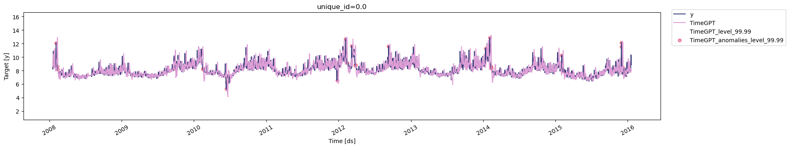
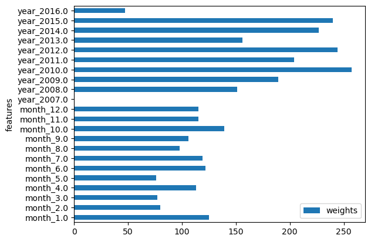

```python
!pip install -Uqq nixtla
```


```python
from nixtla.utils import in_colab
```


```python
IN_COLAB = in_colab()
```


```python
if not IN_COLAB:
    from nixtla.utils import colab_badge
    from dotenv import load_dotenv
```


If your dataset lacks exogenous variables, add date features to inform
the model for historical anomaly detection. Use the `date_features`
argument. Set it to `True` to extract all possible features, or pass a
list of specific features to include.

<figure>
<a
href="https://colab.research.google.com/github/Nixtla/nixtla/blob/main/nbs/docs/capabilities/anomaly-detection/03_anomaly_detection_date_features.ipynb"></a>
</figure>

```python
import pandas as pd
from nixtla import NixtlaClient
```


```python
nixtla_client = NixtlaClient(
    # defaults to os.environ.get("NIXTLA_API_KEY")
    api_key = 'my_api_key_provided_by_nixtla'
)
```

> 👍 Use an Azure AI endpoint
>
> To use an Azure AI endpoint, set the `base_url` argument:
>
> `nixtla_client = NixtlaClient(base_url="you azure ai endpoint", api_key="your api_key")`


```python
if not IN_COLAB:
    nixtla_client = NixtlaClient()
```


```python
# Read the data
df = pd.read_csv('https://datasets-nixtla.s3.amazonaws.com/peyton-manning.csv')

# Add date features for anomaly detection
# Here, we use date features at the month and year levels
anomalies_df_x = nixtla_client.detect_anomalies(
    df,
    freq='D', 
    date_features=['month', 'year'],
    date_features_to_one_hot=True,
    level=99.99,
)

# Plot anomalies
nixtla_client.plot(df, anomalies_df_x)
```

``` text
INFO:nixtla.nixtla_client:Validating inputs...
INFO:nixtla.nixtla_client:Preprocessing dataframes...
INFO:nixtla.nixtla_client:Querying model metadata...
INFO:nixtla.nixtla_client:Using the following exogenous features: ['month_1.0', 'month_2.0', 'month_3.0', 'month_4.0', 'month_5.0', 'month_6.0', 'month_7.0', 'month_8.0', 'month_9.0', 'month_10.0', 'month_11.0', 'month_12.0', 'year_2007.0', 'year_2008.0', 'year_2009.0', 'year_2010.0', 'year_2011.0', 'year_2012.0', 'year_2013.0', 'year_2014.0', 'year_2015.0', 'year_2016.0']
INFO:nixtla.nixtla_client:Calling Anomaly Detector Endpoint...
```



```python
# Plot weights of date features
nixtla_client.weights_x.plot.barh(x='features', y='weights')
```



> 📘 Available models in Azure AI
>
> If you use an Azure AI endpoint, set `model="azureai"`
>
> `nixtla_client.detect_anomalies(..., model="azureai")`
>
> For the public API, two models are supported: `timegpt-1` and
> `timegpt-1-long-horizon`.
>
> By default, `timegpt-1` is used. See [this
> tutorial](https://docs.nixtla.io/docs/tutorials-long_horizon_forecasting)
> for details on using `timegpt-1-long-horizon`.

For more details, check out our in-depth tutorial on [anomaly
detection](https://docs.nixtla.io/docs/tutorials/anomaly_detection).

