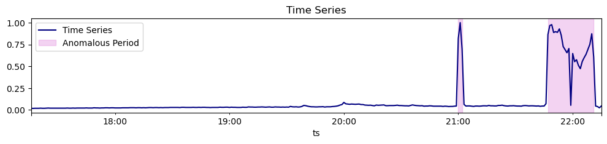
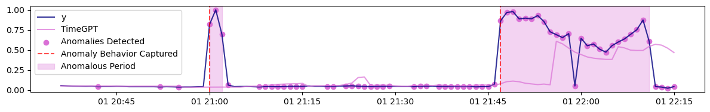

```python
!pip install -Uqq nixtla
```


```python
from nixtla.utils import in_colab
```


```python
IN_COLAB = in_colab()
```


```python
if not IN_COLAB:
    from nixtla.utils import colab_badge
    from dotenv import load_dotenv
```


In this notebook, we introduce the `detect_anomalies_online` method. You
will learn how to quickly start using this new endpoint and understand
its key differences from the historical anomaly detection endpoint. New
features include: \* More flexibility and control over the anomaly
detection process \* Perform univariate and multivariate anomaly
detection \* Detect anomalies on stream data

<figure>
<a
href="https://colab.research.google.com/github/Nixtla/nixtla/blob/main/nbs/docs/capabilities/online-anomaly-detection/01_quickstart.ipynb"></a>
</figure>

```python
import pandas as pd
from nixtla import NixtlaClient
import matplotlib.pyplot as plt
```


```python
nixtla_client = NixtlaClient(
    # defaults to os.environ.get("NIXTLA_API_KEY")
    api_key = 'my_api_key_provided_by_nixtla'
)
```

> 👍 Use an Azure AI endpoint
>
> To use an Azure AI endpoint, set the `base_url` argument:
>
> `nixtla_client = NixtlaClient(base_url="you azure ai endpoint", api_key="your api_key")`


```python
if not IN_COLAB:
    nixtla_client = NixtlaClient()
```


## 1. Dataset

In this notebook, we use a minute-level time series dataset that
monitors server usage. This is a good example of a streaming data
scenario, as the task is to detect server failures or downtime.

```python
df = pd.read_csv('https://datasets-nixtla.s3.us-east-1.amazonaws.com/machine-1-1.csv', parse_dates=['ts'])
```

We observe that the time series remains stable during the initial
period; however, a spike occurs in the last 20 steps, indicating an
anomalous behavior. Our goal is to capture this abnormal jump as soon as
it appears. Let’s see how the real-time anomaly detection capability of
TimeGPT performs in this scenario!



## 2. Detect anomalies in real time

The `detect_anomalies_online` method detect anomalies in a time series
leveraging TimeGPT’s forecast power. It uses the forecast error in
deciding the anomalous step so you can specify and tune the parameters
like that of the `forecast` method. This function will return a
dataframe that contains anomaly flags and anomaly score (its absolute
value quantifies the abnormality of the value).

To perfom real-time anomaly detection, set the following parameters:

-   `df`: A pandas DataFrame containing the time series data.
-   `time_col`: The column that identifies the datestamp.
-   `target_col`: The variable to forecast.
-   `h`: Horizon is the number of steps ahead to make forecast.
-   `freq`: The frequency of the time series in Pandas format.
-   `level`: Percentile of scores distribution at which the threshold is
    set, controlling how strictly anomalies are flagged. Default at 99%.
-   `detection_size`: The number of steps to analyze for anomaly at the
    end of time series.

```python
anomaly_online = nixtla_client.detect_anomalies_online(
    df,
    time_col='ts',                  
    target_col='y',                 
    freq='min',                     # Specify the frequency of the data
    h=10,                           # Specify the forecast horizon
    level=99,                       # Set the confidence level for anomaly detection
    detection_size=100              # How many steps you want for analyzing anomalies
)
anomaly_online.tail()
```

``` text
INFO:nixtla.nixtla_client:Validating inputs...
INFO:nixtla.nixtla_client:Preprocessing dataframes...
INFO:nixtla.nixtla_client:Calling Online Anomaly Detector Endpoint...
```

|     | unique_id        | ts                  | y        | TimeGPT  | anomaly | anomaly_score | TimeGPT-hi-99 | TimeGPT-lo-99 |
|-----|------------------|---------------------|----------|----------|---------|---------------|---------------|---------------|
| 95  | machine-1-1_y_29 | 2020-02-01 22:11:00 | 0.606017 | 0.544625 | True    | 18.463266     | 0.553161      | 0.536090      |
| 96  | machine-1-1_y_29 | 2020-02-01 22:12:00 | 0.044413 | 0.570869 | True    | -158.933850   | 0.579404      | 0.562333      |
| 97  | machine-1-1_y_29 | 2020-02-01 22:13:00 | 0.038682 | 0.560303 | True    | -157.474880   | 0.568839      | 0.551767      |
| 98  | machine-1-1_y_29 | 2020-02-01 22:14:00 | 0.024355 | 0.521797 | True    | -150.178240   | 0.530333      | 0.513261      |
| 99  | machine-1-1_y_29 | 2020-02-01 22:15:00 | 0.044413 | 0.467860 | True    | -127.848560   | 0.476396      | 0.459325      |

> 📘 In this example, we use a detection size of 100 to illustrate the
> anomaly detection process. In practice, using a smaller detection size
> and running the detection more frequently improves granularity and
> enables more timely identification of anomalies as they occur.

From the plot, we observe that both anomalous periods were detected
right as they arose. For further methods on improving detection accuracy
and customizing anomaly detection, read our other tutorials on online
anomaly detection.



For an in-depth analysis of the `detect_anomalies_online` method, refer
to the tutorial (coming soon).

