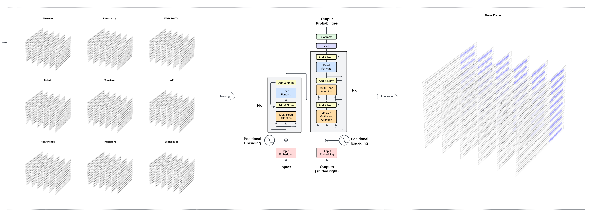

## Introduction

Nixtla’s TimeGPT is a generative pre-trained forecasting model for time
series data. TimeGPT can produce accurate forecasts for new time series
without training, using only historical values as inputs. TimeGPT can be
used across a plethora of tasks including demand forecasting, anomaly
detection, financial forecasting, and more.

The TimeGPT model “reads” time series data much like the way humans read
a sentence – from left to right. It looks at windows of past data, which
we can think of as “tokens”, and predicts what comes next. This
prediction is based on patterns the model identifies in past data and
extrapolates into the future.

The API provides an interface to TimeGPT, allowing users to leverage its
forecasting capabilities to predict future events. TimeGPT can also be
used for other time series-related tasks, such as what-if scenarios,
anomaly detection, and more.

<figure>

<figcaption aria-hidden="true">figure</figcaption>
</figure>

## Usage

```python
from nixtla import NixtlaClient
```

You can instantiate the `NixtlaClient` class providing your credentials.

```python
nixtla_client = NixtlaClient(
    # defaults to os.environ.get("NIXTLA_API_KEY")
    api_key = 'my_api_key_provided_by_nixtla'
)
```

Check your token status with the `validate_api_key` method.

```python
nixtla_client.validate_api_key()
```

To learn more about how to set up your token, please refer to the
[Setting Up your Authentication
Token](https://nixtlaverse.nixtla.io/nixtla/docs/getting-started/setting_up_your_authentication_token.html)
tutorial.

Now you can start making forecasts! Let’s import an example on the
classic `AirPassengers` dataset. This dataset contains the monthly
number of airline passengers in Australia between 1949 and 1960. First,
let’s load the dataset and plot it:

```python
import pandas as pd
```


```python
df = pd.read_csv('https://raw.githubusercontent.com/Nixtla/transfer-learning-time-series/main/datasets/air_passengers.csv')
df.head()
```


```python
nixtla_client.plot(df, time_col='timestamp', target_col='value')
```

> **Important requirements of the data**
>
> -   Make sure the target variable column does not have missing or
>     non-numeric values.
> -   Do not include gaps/jumps in the datestamps (for the given
>     frequency) between the first and late datestamps. The forecast
>     function will not impute missing dates.
> -   The format of the datestamp column should be readable by Pandas
>     (see [this
>     link](https://pandas.pydata.org/docs/reference/api/pandas.to_datetime.html)
>     for more details).

Next, forecast the next 12 months using the SDK `forecast` method. Set
the following parameters:

-   `df`: A pandas dataframe containing the time series data.
-   `h`: The number of steps ahead to forecast.
-   `freq`: The frequency of the time series in Pandas format. See
    [pandas’ available
    frequencies](https://pandas.pydata.org/pandas-docs/stable/user_guide/timeseries.html#offset-aliases).
-   `time_col`: Column that identifies the datestamp column.
-   `target_col`: The variable that we want to forecast.

```python
timegpt_fcst_df = nixtla_client.forecast(df=df, h=12, freq='MS', time_col='timestamp', target_col='value')
timegpt_fcst_df.head()
```


```python
nixtla_client.plot(df, timegpt_fcst_df, time_col='timestamp', target_col='value')
```

You can also produce a longer forecasts increasing the horizon
parameter. For example, let’s forecast the next 36 months:

```python
timegpt_fcst_df = nixtla_client.forecast(df=df, h=36, time_col='timestamp', target_col='value', freq='MS')
timegpt_fcst_df.head()
```


```python
nixtla_client.plot(df, timegpt_fcst_df, time_col='timestamp', target_col='value')
```

Or a shorter one:

```python
timegpt_fcst_df = nixtla_client.forecast(df=df, h=6, time_col='timestamp', target_col='value', freq='MS')
nixtla_client.plot(df, timegpt_fcst_df, time_col='timestamp', target_col='value')
```

> **Warning**
>
> TimeGPT-1 is currently optimized for short horizon forecasting. While
> the `forecast` mehtod will allow any positive and large horizon, the
> accuracy of the forecasts might degrade. We are currently working to
> improve the accuracy on longer forecasts.

## Using DateTime index to infer frequency

The freq parameter, which indicates the time unit between consecutive
data points, is particularly critical. Fortunately, you can pass a
DataFrame with a DateTime index to the forecasting method, ensuring that
your time series data is equipped with necessary temporal features. By
assigning a suitable freq parameter to the DateTime index of a
DataFrame, you inform the model about the consistent interval between
observations — be it days (‘D’), months (‘M’), or another suitable
frequency.

```python
df_time_index = df.set_index('timestamp')
df_time_index.index = pd.DatetimeIndex(df_time_index.index, freq='MS')
nixtla_client.forecast(df=df, h=36, time_col='timestamp', target_col='value').head()
```

