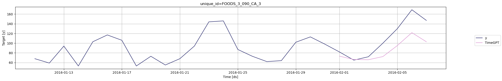
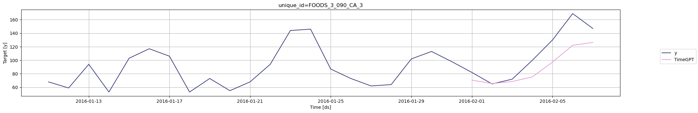

```python
!pip install -Uqq nixtla datasetsforecast
```


```python
from nixtla.utils import in_colab
```


```python
IN_COLAB = in_colab()
```


```python
if not IN_COLAB:
    from nixtla.utils import colab_badge
    from dotenv import load_dotenv
```


Categorical variables are external factors that can influence a
forecast. These variables take on one of a limited, fixed number of
possible values, and induce a grouping of your observations.  
  
For example, if you’re forecasting daily product demand for a retailer,
you could benefit from an event variable that may tell you what kind of
event takes place on a given day, for example ‘None’, ‘Sporting’, or
‘Cultural’.  
  
To incorporate categorical variables in TimeGPT, you’ll need to pair
each point in your time series data with the corresponding external
data.

<figure>
<a
href="https://colab.research.google.com/github/Nixtla/nixtla/blob/main/nbs/docs/tutorials/03_categorical_variables.ipynb"></a>
</figure>

## 1. Import packages

First, we install and import the required packages and initialize the
Nixtla client.

```python
import pandas as pd
import os

from nixtla import NixtlaClient
from datasetsforecast.m5 import M5
```


```python
nixtla_client = NixtlaClient(
    # defaults to os.environ.get("NIXTLA_API_KEY")
    api_key = 'my_api_key_provided_by_nixtla'   
)
```

> 👍 Use an Azure AI endpoint
>
> To use an Azure AI endpoint, remember to set also the `base_url`
> argument:
>
> `nixtla_client = NixtlaClient(base_url="you azure ai endpoint", api_key="your api_key")`


```python
if not IN_COLAB:
    nixtla_client = NixtlaClient()
```


## 2. Load M5 data

Let’s see an example on predicting sales of products of the [M5
dataset](https://nixtlaverse.nixtla.io/datasetsforecast/m5.html). The M5
dataset contains daily product demand (sales) for 10 retail stores in
the US.  
  
First, we load the data using `datasetsforecast`. This returns:

-   `Y_df`, containing the sales (`y` column), for each unique product
    (`unique_id` column) at every timestamp (`ds` column).
-   `X_df`, containing additional relevant information for each unique
    product (`unique_id` column) at every timestamp (`ds` column).

```python
Y_df, X_df, _ = M5.load(directory=os.getcwd())
Y_df['ds'] = pd.to_datetime(Y_df['ds'])
X_df['ds'] = pd.to_datetime(X_df['ds'])
Y_df.head(10)
```

|     | unique_id        | ds         | y   |
|-----|------------------|------------|-----|
| 0   | FOODS_1_001_CA_1 | 2011-01-29 | 3.0 |
| 1   | FOODS_1_001_CA_1 | 2011-01-30 | 0.0 |
| 2   | FOODS_1_001_CA_1 | 2011-01-31 | 0.0 |
| 3   | FOODS_1_001_CA_1 | 2011-02-01 | 1.0 |
| 4   | FOODS_1_001_CA_1 | 2011-02-02 | 4.0 |
| 5   | FOODS_1_001_CA_1 | 2011-02-03 | 2.0 |
| 6   | FOODS_1_001_CA_1 | 2011-02-04 | 0.0 |
| 7   | FOODS_1_001_CA_1 | 2011-02-05 | 2.0 |
| 8   | FOODS_1_001_CA_1 | 2011-02-06 | 0.0 |
| 9   | FOODS_1_001_CA_1 | 2011-02-07 | 0.0 |

For this example, we will only keep the additional relevant information
from the column `event_type_1`. This column is a *categorical variable*
that indicates whether an important event that might affect the sales of
the product takes place at a certain date.

```python
X_df = X_df[['unique_id', 'ds', 'event_type_1']]

X_df.head(10)
```

|     | unique_id        | ds         | event_type_1 |
|-----|------------------|------------|--------------|
| 0   | FOODS_1_001_CA_1 | 2011-01-29 | nan          |
| 1   | FOODS_1_001_CA_1 | 2011-01-30 | nan          |
| 2   | FOODS_1_001_CA_1 | 2011-01-31 | nan          |
| 3   | FOODS_1_001_CA_1 | 2011-02-01 | nan          |
| 4   | FOODS_1_001_CA_1 | 2011-02-02 | nan          |
| 5   | FOODS_1_001_CA_1 | 2011-02-03 | nan          |
| 6   | FOODS_1_001_CA_1 | 2011-02-04 | nan          |
| 7   | FOODS_1_001_CA_1 | 2011-02-05 | nan          |
| 8   | FOODS_1_001_CA_1 | 2011-02-06 | Sporting     |
| 9   | FOODS_1_001_CA_1 | 2011-02-07 | nan          |

As you can see, on February 6th 2011, there is a Sporting event.

## 3. Forecasting product demand using categorical variables

We will forecast the demand for a single product only. We choose a high
selling food product identified by `FOODS_3_090_CA_3`.

```python
product = 'FOODS_3_090_CA_3'
Y_df_product = Y_df.query('unique_id == @product')
X_df_product = X_df.query('unique_id == @product')
```

We merge our two dataframes to create the dataset to be used in TimeGPT.

```python
df = Y_df_product.merge(X_df_product)

df.head(10)
```

|     | unique_id        | ds         | y     | event_type_1 |
|-----|------------------|------------|-------|--------------|
| 0   | FOODS_3_090_CA_3 | 2011-01-29 | 108.0 | nan          |
| 1   | FOODS_3_090_CA_3 | 2011-01-30 | 132.0 | nan          |
| 2   | FOODS_3_090_CA_3 | 2011-01-31 | 102.0 | nan          |
| 3   | FOODS_3_090_CA_3 | 2011-02-01 | 120.0 | nan          |
| 4   | FOODS_3_090_CA_3 | 2011-02-02 | 106.0 | nan          |
| 5   | FOODS_3_090_CA_3 | 2011-02-03 | 123.0 | nan          |
| 6   | FOODS_3_090_CA_3 | 2011-02-04 | 279.0 | nan          |
| 7   | FOODS_3_090_CA_3 | 2011-02-05 | 175.0 | nan          |
| 8   | FOODS_3_090_CA_3 | 2011-02-06 | 186.0 | Sporting     |
| 9   | FOODS_3_090_CA_3 | 2011-02-07 | 120.0 | nan          |


```python
if not IN_COLAB:
    df = pd.read_parquet("../../assets/M5_categorical_variables_example.parquet")
```


In order to use *categorical variables* with TimeGPT, it is necessary to
numerically encode the variables. We will use *one-hot encoding* in this
tutorial.

We can one-hot encode the `event_type_1` column by using pandas built-in
`get_dummies` functionality. After one-hot encoding the `event_type_1`
variable, we can add it to the dataframe and remove the original column.

```python
event_type_1_ohe = pd.get_dummies(df['event_type_1'], dtype=int)
df = pd.concat([df, event_type_1_ohe], axis=1)
df = df.drop(columns = 'event_type_1')

df.tail(10)
```

|      | unique_id        | ds         | y     | Cultural | National | Religious | Sporting | nan |
|------|------------------|------------|-------|----------|----------|-----------|----------|-----|
| 1959 | FOODS_3_090_CA_3 | 2016-06-10 | 140.0 | 0        | 0        | 0         | 0        | 1   |
| 1960 | FOODS_3_090_CA_3 | 2016-06-11 | 151.0 | 0        | 0        | 0         | 0        | 1   |
| 1961 | FOODS_3_090_CA_3 | 2016-06-12 | 87.0  | 0        | 0        | 0         | 0        | 1   |
| 1962 | FOODS_3_090_CA_3 | 2016-06-13 | 67.0  | 0        | 0        | 0         | 0        | 1   |
| 1963 | FOODS_3_090_CA_3 | 2016-06-14 | 50.0  | 0        | 0        | 0         | 0        | 1   |
| 1964 | FOODS_3_090_CA_3 | 2016-06-15 | 58.0  | 0        | 0        | 0         | 0        | 1   |
| 1965 | FOODS_3_090_CA_3 | 2016-06-16 | 116.0 | 0        | 0        | 0         | 0        | 1   |
| 1966 | FOODS_3_090_CA_3 | 2016-06-17 | 124.0 | 0        | 0        | 0         | 0        | 1   |
| 1967 | FOODS_3_090_CA_3 | 2016-06-18 | 167.0 | 0        | 0        | 0         | 0        | 1   |
| 1968 | FOODS_3_090_CA_3 | 2016-06-19 | 118.0 | 0        | 0        | 0         | 1        | 0   |

As you can see, we have now added 5 columns, each with a binary
indicator (`1` or `0`) whether there is a `Cultural`, `National`,
`Religious`, `Sporting` or no (`nan`) event on that particular day. For
example, on June 19th 2016, there is a `Sporting` event.

Let’s turn to our forecasting task. We will forecast the first 7 days of
February 2016. This includes 7 February 2016 - the date on which [Super
Bowl 50](https://en.wikipedia.org/wiki/Super_Bowl_50) was held. Such
large, national events typically impact retail product sales.

To use the encoded categorical variables in TimeGPT, we have to add them
as future values. Therefore, we create a future values dataframe, that
contains the `unique_id`, the timestamp `ds`, and the encoded
categorical variables.

Of course, we drop the target column as this is normally not available -
this is the quantity that we seek to forecast!

```python
future_ex_vars_df = df.drop(columns = ['y'])
future_ex_vars_df = future_ex_vars_df.query("ds >= '2016-02-01' & ds <= '2016-02-07'")

future_ex_vars_df.head(10)
```

|      | unique_id        | ds         | Cultural | National | Religious | Sporting | nan |
|------|------------------|------------|----------|----------|-----------|----------|-----|
| 1829 | FOODS_3_090_CA_3 | 2016-02-01 | 0        | 0        | 0         | 0        | 1   |
| 1830 | FOODS_3_090_CA_3 | 2016-02-02 | 0        | 0        | 0         | 0        | 1   |
| 1831 | FOODS_3_090_CA_3 | 2016-02-03 | 0        | 0        | 0         | 0        | 1   |
| 1832 | FOODS_3_090_CA_3 | 2016-02-04 | 0        | 0        | 0         | 0        | 1   |
| 1833 | FOODS_3_090_CA_3 | 2016-02-05 | 0        | 0        | 0         | 0        | 1   |
| 1834 | FOODS_3_090_CA_3 | 2016-02-06 | 0        | 0        | 0         | 0        | 1   |
| 1835 | FOODS_3_090_CA_3 | 2016-02-07 | 0        | 0        | 0         | 1        | 0   |

Next, we limit our input dataframe to all but the 7 forecast days:

```python
df_train = df.query("ds < '2016-02-01'")

df_train.tail(10)
```

|      | unique_id        | ds         | y     | Cultural | National | Religious | Sporting | nan |
|------|------------------|------------|-------|----------|----------|-----------|----------|-----|
| 1819 | FOODS_3_090_CA_3 | 2016-01-22 | 94.0  | 0        | 0        | 0         | 0        | 1   |
| 1820 | FOODS_3_090_CA_3 | 2016-01-23 | 144.0 | 0        | 0        | 0         | 0        | 1   |
| 1821 | FOODS_3_090_CA_3 | 2016-01-24 | 146.0 | 0        | 0        | 0         | 0        | 1   |
| 1822 | FOODS_3_090_CA_3 | 2016-01-25 | 87.0  | 0        | 0        | 0         | 0        | 1   |
| 1823 | FOODS_3_090_CA_3 | 2016-01-26 | 73.0  | 0        | 0        | 0         | 0        | 1   |
| 1824 | FOODS_3_090_CA_3 | 2016-01-27 | 62.0  | 0        | 0        | 0         | 0        | 1   |
| 1825 | FOODS_3_090_CA_3 | 2016-01-28 | 64.0  | 0        | 0        | 0         | 0        | 1   |
| 1826 | FOODS_3_090_CA_3 | 2016-01-29 | 102.0 | 0        | 0        | 0         | 0        | 1   |
| 1827 | FOODS_3_090_CA_3 | 2016-01-30 | 113.0 | 0        | 0        | 0         | 0        | 1   |
| 1828 | FOODS_3_090_CA_3 | 2016-01-31 | 98.0  | 0        | 0        | 0         | 0        | 1   |

Let’s call the `forecast` method, first *without* the categorical
variables.

```python
timegpt_fcst_without_cat_vars_df = nixtla_client.forecast(df=df_train, h=7, level=[80, 90])
timegpt_fcst_without_cat_vars_df.head()
```

``` text
INFO:nixtla.nixtla_client:Validating inputs...
INFO:nixtla.nixtla_client:Preprocessing dataframes...
INFO:nixtla.nixtla_client:Inferred freq: D
INFO:nixtla.nixtla_client:Restricting input...
INFO:nixtla.nixtla_client:Calling Forecast Endpoint...
```

|     | unique_id        | ds         | TimeGPT   | TimeGPT-lo-90 | TimeGPT-lo-80 | TimeGPT-hi-80 | TimeGPT-hi-90 |
|-----|------------------|------------|-----------|---------------|---------------|---------------|---------------|
| 0   | FOODS_3_090_CA_3 | 2016-02-01 | 73.304092 | 53.449049     | 54.795078     | 91.813107     | 93.159136     |
| 1   | FOODS_3_090_CA_3 | 2016-02-02 | 66.335518 | 47.510669     | 50.274136     | 82.396899     | 85.160367     |
| 2   | FOODS_3_090_CA_3 | 2016-02-03 | 65.881630 | 36.218617     | 41.388896     | 90.374364     | 95.544643     |
| 3   | FOODS_3_090_CA_3 | 2016-02-04 | 72.371864 | -26.683115    | 25.097362     | 119.646367    | 171.426844    |
| 4   | FOODS_3_090_CA_3 | 2016-02-05 | 95.141045 | -2.084882     | 34.027078     | 156.255011    | 192.366971    |

> 📘 Available models in Azure AI
>
> If you are using an Azure AI endpoint, please be sure to set
> `model="azureai"`:
>
> `nixtla_client.forecast(..., model="azureai")`
>
> For the public API, we support two models: `timegpt-1` and
> `timegpt-1-long-horizon`.
>
> By default, `timegpt-1` is used. Please see [this
> tutorial](https://docs.nixtla.io/docs/tutorials-long_horizon_forecasting)
> on how and when to use `timegpt-1-long-horizon`.

We plot the forecast and the last 28 days before the forecast period:

```python
nixtla_client.plot(
    df[['unique_id', 'ds', 'y']].query("ds <= '2016-02-07'"), 
    timegpt_fcst_without_cat_vars_df, 
    max_insample_length=28, 
)
```



TimeGPT already provides a reasonable forecast, but it seems to somewhat
underforecast the peak on the 6th of February 2016 - the day before the
Super Bowl.

Let’s call the `forecast` method again, now *with* the categorical
variables.

```python
timegpt_fcst_with_cat_vars_df = nixtla_client.forecast(df=df_train, X_df=future_ex_vars_df, h=7, level=[80, 90])
timegpt_fcst_with_cat_vars_df.head()
```

``` text
INFO:nixtla.nixtla_client:Validating inputs...
INFO:nixtla.nixtla_client:Preprocessing dataframes...
INFO:nixtla.nixtla_client:Inferred freq: D
INFO:nixtla.nixtla_client:Using the following exogenous variables: Cultural, National, Religious, Sporting, nan
INFO:nixtla.nixtla_client:Calling Forecast Endpoint...
```

|     | unique_id        | ds         | TimeGPT   | TimeGPT-lo-90 | TimeGPT-lo-80 | TimeGPT-hi-80 | TimeGPT-hi-90 |
|-----|------------------|------------|-----------|---------------|---------------|---------------|---------------|
| 0   | FOODS_3_090_CA_3 | 2016-02-01 | 70.661271 | -0.204378     | 14.593348     | 126.729194    | 141.526919    |
| 1   | FOODS_3_090_CA_3 | 2016-02-02 | 65.566941 | -20.394326    | 11.654239     | 119.479643    | 151.528208    |
| 2   | FOODS_3_090_CA_3 | 2016-02-03 | 68.510010 | -33.713710    | 6.732952      | 130.287069    | 170.733731    |
| 3   | FOODS_3_090_CA_3 | 2016-02-04 | 75.417710 | -40.974649    | 4.751767      | 146.083653    | 191.810069    |
| 4   | FOODS_3_090_CA_3 | 2016-02-05 | 97.340302 | -57.385361    | 18.253812     | 176.426792    | 252.065965    |

> 📘 Available models in Azure AI
>
> If you are using an Azure AI endpoint, please be sure to set
> `model="azureai"`:
>
> `nixtla_client.forecast(..., model="azureai")`
>
> For the public API, we support two models: `timegpt-1` and
> `timegpt-1-long-horizon`.
>
> By default, `timegpt-1` is used. Please see [this
> tutorial](https://docs.nixtla.io/docs/tutorials-long_horizon_forecasting)
> on how and when to use `timegpt-1-long-horizon`.

We plot the forecast and the last 28 days before the forecast period:

```python
nixtla_client.plot(
    df[['unique_id', 'ds', 'y']].query("ds <= '2016-02-07'"), 
    timegpt_fcst_with_cat_vars_df, 
    max_insample_length=28, 
)
```



We can visually verify that the forecast is closer to the actual
observed value, which is the result of including the categorical
variable in our forecast.

Let’s verify this conclusion by computing the [Mean Absolute
Error](https://en.wikipedia.org/wiki/Mean_absolute_error) on the
forecasts we created.

```python
from utilsforecast.losses import mae
```


```python
# Create target dataframe
df_target = df[['unique_id', 'ds', 'y']].query("ds >= '2016-02-01' & ds <= '2016-02-07'")

# Rename forecast columns
timegpt_fcst_without_cat_vars_df = timegpt_fcst_without_cat_vars_df.rename(columns={'TimeGPT': 'TimeGPT-without-cat-vars'})
timegpt_fcst_with_cat_vars_df = timegpt_fcst_with_cat_vars_df.rename(columns={'TimeGPT': 'TimeGPT-with-cat-vars'})

# Merge forecasts with target dataframe
df_target = df_target.merge(timegpt_fcst_without_cat_vars_df[['unique_id', 'ds', 'TimeGPT-without-cat-vars']])
df_target = df_target.merge(timegpt_fcst_with_cat_vars_df[['unique_id', 'ds', 'TimeGPT-with-cat-vars']])

# Compute errors
mean_absolute_errors = mae(df_target, ['TimeGPT-without-cat-vars', 'TimeGPT-with-cat-vars'])
```


```python
mean_absolute_errors
```

|     | unique_id        | TimeGPT-without-cat-vars | TimeGPT-with-cat-vars |
|-----|------------------|--------------------------|-----------------------|
| 0   | FOODS_3_090_CA_3 | 24.285649                | 20.028514             |

Indeed, we find that the error when using TimeGPT with the categorical
variable is approx. 20% lower than when using TimeGPT without the
categorical variables, indicating better performance when we include the
categorical variable.

