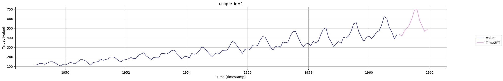

```python
!pip install -Uqq nixtla utilsforecast
```


```python
from nixtla.utils import in_colab
```


```python
IN_COLAB = in_colab()
```


```python
if not IN_COLAB:
    from nixtla.utils import colab_badge
    from dotenv import load_dotenv
```


When fine-tuning, the model trains on your dataset to tailor its
predictions to your particular scenario. As such, it is possible to
specify the loss function used during fine-tuning.  
  
Specifically, you can choose from:

-   `"default"` - a proprietary loss function that is robust to outliers
-   `"mae"` - mean absolute error
-   `"mse"` - mean squared error
-   `"rmse"` - root mean squared error
-   `"mape"` - mean absolute percentage error
-   `"smape"` - symmetric mean absolute percentage error

<figure>
<a
href="https://colab.research.google.com/github/Nixtla/nixtla/blob/main/nbs/docs/tutorials/07_loss_function_finetuning.ipynb"></a>
</figure>

## 1. Import packages

First, we import the required packages and initialize the Nixtla client.

```python
import pandas as pd
from nixtla import NixtlaClient
from utilsforecast.losses import mae, mse, rmse, mape, smape
```


```python
nixtla_client = NixtlaClient(
    # defaults to os.environ.get("NIXTLA_API_KEY")
    api_key = 'my_api_key_provided_by_nixtla'
)
```

> 👍 Use an Azure AI endpoint
>
> To use an Azure AI endpoint, remember to set also the `base_url`
> argument:
>
> `nixtla_client = NixtlaClient(base_url="you azure ai endpoint", api_key="your api_key")`


```python
if not IN_COLAB:
    nixtla_client = NixtlaClient()
```


## 2. Load data

Let’s fine-tune the model on a dataset using the mean absolute error
(MAE).  
  
For that, we simply pass the appropriate string representing the loss
function to the `finetune_loss` parameter of the `forecast` method.

```python
df = pd.read_csv('https://raw.githubusercontent.com/Nixtla/transfer-learning-time-series/main/datasets/air_passengers.csv')
df.insert(loc=0, column='unique_id', value=1)

df.head()
```

|     | unique_id | timestamp  | value |
|-----|-----------|------------|-------|
| 0   | 1         | 1949-01-01 | 112   |
| 1   | 1         | 1949-02-01 | 118   |
| 2   | 1         | 1949-03-01 | 132   |
| 3   | 1         | 1949-04-01 | 129   |
| 4   | 1         | 1949-05-01 | 121   |

## 3. Fine-tuning with Mean Absolute Error

Let’s fine-tune the model on a dataset using the Mean Absolute Error
(MAE).  
  
For that, we simply pass the appropriate string representing the loss
function to the `finetune_loss` parameter of the `forecast` method.

```python
timegpt_fcst_finetune_mae_df = nixtla_client.forecast(
    df=df, 
    h=12, 
    finetune_steps=10,
    finetune_loss='mae',   # Set your desired loss function
    time_col='timestamp', 
    target_col='value',
)
```

``` text
INFO:nixtla.nixtla_client:Validating inputs...
INFO:nixtla.nixtla_client:Preprocessing dataframes...
INFO:nixtla.nixtla_client:Inferred freq: MS
INFO:nixtla.nixtla_client:Calling Forecast Endpoint...
```

> 📘 Available models in Azure AI
>
> If you are using an Azure AI endpoint, please be sure to set
> `model="azureai"`:
>
> `nixtla_client.forecast(..., model="azureai")`
>
> For the public API, we support two models: `timegpt-1` and
> `timegpt-1-long-horizon`.
>
> By default, `timegpt-1` is used. Please see [this
> tutorial](https://docs.nixtla.io/docs/tutorials-long_horizon_forecasting)
> on how and when to use `timegpt-1-long-horizon`.

```python
nixtla_client.plot(
    df, timegpt_fcst_finetune_mae_df, 
    time_col='timestamp', target_col='value',
)
```



Now, depending on your data, you will use a specific error metric to
accurately evaluate your forecasting model’s performance.  
  
Below is a non-exhaustive guide on which metric to use depending on your
use case.  
  
**Mean absolute error (MAE)**  
  


-   Robust to outliers
-   Easy to understand
-   You care equally about all error sizes
-   Same units as your data

**Mean squared error (MSE)**  
  


-   You want to penalize large errors more than small ones
-   Sensitive to outliers
-   Used when large errors must be avoided
-   *Not* the same units as your data

**Root mean squared error (RMSE)**  
  


-   Brings the MSE back to original units of data
-   Penalizes large errors more than small ones

**Mean absolute percentage error (MAPE)**  
  


-   Easy to understand for non-technical stakeholders
-   Expressed as a percentage
-   Heavier penalty on positive errors over negative errors
-   To be avoided if your data has values close to 0 or equal to 0

**Symmmetric mean absolute percentage error (sMAPE)**  
  


-   Fixes bias of MAPE
-   Equally senstitive to over and under forecasting
-   To be avoided if your data has values close to 0 or equal to 0

With TimeGPT, you can choose your loss function during fine-tuning as to
maximize the model’s performance metric for your particular use case.  
  
Let’s run a small experiment to see how each loss function improves
their associated metric when compared to the default setting.

```python
train = df[:-36]
test = df[-36:]
```


```python
losses = ['default', 'mae', 'mse', 'rmse', 'mape', 'smape']

test = test.copy()

for loss in losses:
    preds_df = nixtla_client.forecast(
    df=train, 
    h=36, 
    finetune_steps=10,
    finetune_loss=loss,
    time_col='timestamp', 
    target_col='value')

    preds = preds_df['TimeGPT'].values

    test.loc[:,f'TimeGPT_{loss}'] = preds
```

``` text
INFO:nixtla.nixtla_client:Validating inputs...
INFO:nixtla.nixtla_client:Preprocessing dataframes...
INFO:nixtla.nixtla_client:Inferred freq: MS
WARNING:nixtla.nixtla_client:The specified horizon "h" exceeds the model horizon. This may lead to less accurate forecasts. Please consider using a smaller horizon.
INFO:nixtla.nixtla_client:Calling Forecast Endpoint...
INFO:nixtla.nixtla_client:Validating inputs...
INFO:nixtla.nixtla_client:Preprocessing dataframes...
INFO:nixtla.nixtla_client:Inferred freq: MS
WARNING:nixtla.nixtla_client:The specified horizon "h" exceeds the model horizon. This may lead to less accurate forecasts. Please consider using a smaller horizon.
INFO:nixtla.nixtla_client:Calling Forecast Endpoint...
INFO:nixtla.nixtla_client:Validating inputs...
INFO:nixtla.nixtla_client:Preprocessing dataframes...
INFO:nixtla.nixtla_client:Inferred freq: MS
WARNING:nixtla.nixtla_client:The specified horizon "h" exceeds the model horizon. This may lead to less accurate forecasts. Please consider using a smaller horizon.
INFO:nixtla.nixtla_client:Calling Forecast Endpoint...
INFO:nixtla.nixtla_client:Validating inputs...
INFO:nixtla.nixtla_client:Preprocessing dataframes...
INFO:nixtla.nixtla_client:Inferred freq: MS
WARNING:nixtla.nixtla_client:The specified horizon "h" exceeds the model horizon. This may lead to less accurate forecasts. Please consider using a smaller horizon.
INFO:nixtla.nixtla_client:Calling Forecast Endpoint...
INFO:nixtla.nixtla_client:Validating inputs...
INFO:nixtla.nixtla_client:Preprocessing dataframes...
INFO:nixtla.nixtla_client:Inferred freq: MS
WARNING:nixtla.nixtla_client:The specified horizon "h" exceeds the model horizon. This may lead to less accurate forecasts. Please consider using a smaller horizon.
INFO:nixtla.nixtla_client:Calling Forecast Endpoint...
INFO:nixtla.nixtla_client:Validating inputs...
INFO:nixtla.nixtla_client:Preprocessing dataframes...
INFO:nixtla.nixtla_client:Inferred freq: MS
WARNING:nixtla.nixtla_client:The specified horizon "h" exceeds the model horizon. This may lead to less accurate forecasts. Please consider using a smaller horizon.
INFO:nixtla.nixtla_client:Calling Forecast Endpoint...
```

> 📘 Available models in Azure AI
>
> If you are using an Azure AI endpoint, please be sure to set
> `model="azureai"`:
>
> `nixtla_client.forecast(..., model="azureai")`
>
> For the public API, we support two models: `timegpt-1` and
> `timegpt-1-long-horizon`.
>
> By default, `timegpt-1` is used. Please see [this
> tutorial](https://docs.nixtla.io/docs/tutorials-long_horizon_forecasting)
> on how and when to use `timegpt-1-long-horizon`.


```python
test.head()
```

|     | unique_id | timestamp  | value | TimeGPT_default | TimeGPT_mae | TimeGPT_mse | TimeGPT_rmse | TimeGPT_mape | TimeGPT_smape |
|-----|-----------|------------|-------|-----------------|-------------|-------------|--------------|--------------|---------------|
| 108 | 1         | 1958-01-01 | 340   | 347.134094      | 341.933563  | 347.600616  | 347.059113   | 356.154938   | 341.958679    |
| 109 | 1         | 1958-02-01 | 318   | 345.739746      | 343.268738  | 346.399963  | 345.678314   | 354.163422   | 343.929657    |
| 110 | 1         | 1958-03-01 | 362   | 394.611450      | 390.873169  | 395.436646  | 394.636627   | 396.496155   | 392.543640    |
| 111 | 1         | 1958-04-01 | 348   | 404.133545      | 400.997070  | 404.369598  | 403.498901   | 396.927185   | 402.459625    |
| 112 | 1         | 1958-05-01 | 363   | 421.236542      | 418.793365  | 422.122223  | 421.541443   | 410.335663   | 422.161255    |


Great! We have predictions from TimeGPT using all the different loss
functions. We can evaluate the performance using their associated metric
and measure the improvement.

```python
loss_fct_dict = {
    "mae": mae,
    "mse": mse,
    "rmse": rmse,
    "mape": mape,
    "smape": smape
}

pct_improv = []

for loss in losses[1:]:
    evaluation = loss_fct_dict[f'{loss}'](test, models=['TimeGPT_default', f'TimeGPT_{loss}'], id_col='unique_id', target_col='value')
    pct_diff = (evaluation['TimeGPT_default'] - evaluation[f'TimeGPT_{loss}']) / evaluation['TimeGPT_default'] * 100
    pct_improv.append(round(pct_diff, 2))
```


```python
data = {
    'mae': pct_improv[0].values,
    'mse': pct_improv[1].values,
    'rmse': pct_improv[2].values,
    'mape': pct_improv[3].values,
    'smape': pct_improv[4].values
}

metrics_df = pd.DataFrame(data)
metrics_df.index = ['Metric improvement (%)']

metrics_df
```

|                        | mae  | mse  | rmse | mape  | smape |
|------------------------|------|------|------|-------|-------|
| Metric improvement (%) | 8.54 | 0.31 | 0.64 | 31.02 | 7.36  |

From the table above, we can see that using a specific loss function
during fine-tuning will improve its associated error metric when
compared to the default loss function.  
  
In this example, using the MAE as the loss function improves the metric
by 8.54% when compared to using the default loss function.  
  
That way, depending on your use case and performance metric, you can use
the appropriate loss function to maximize the accuracy of the forecasts.

