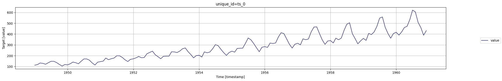
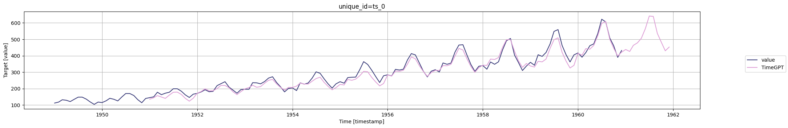

```python
!pip install -Uqq nixtla
```


```python
from nixtla.utils import in_colab
```


```python
IN_COLAB = in_colab()
```


```python
if not IN_COLAB:
    from nixtla.utils import colab_badge
    from dotenv import load_dotenv
```


Our time series model offers a powerful feature that allows users to
retrieve historical forecasts alongside the prospective predictions.
This functionality is accessible through the forecast method by setting
the `add_history=True` argument.

<figure>
<a
href="https://colab.research.google.com/github/Nixtla/nixtla/blob/main/nbs/docs/tutorials/09_historical_forecast.ipynb"></a>
</figure>

## 1. Import packages

First, we install and import the required packages and initialize the
Nixtla client.

```python
import pandas as pd
from nixtla import NixtlaClient
```


```python
nixtla_client = NixtlaClient(
    # defaults to os.environ.get("NIXTLA_API_KEY")
    api_key = 'my_api_key_provided_by_nixtla'
)
```

> 👍 Use an Azure AI endpoint
>
> To use an Azure AI endpoint, set the `base_url` argument:
>
> `nixtla_client = NixtlaClient(base_url="you azure ai endpoint", api_key="your api_key")`


```python
if not IN_COLAB:
    nixtla_client = NixtlaClient()
```


## 2. Load data

Now you can start to make forecasts! Let’s import an example:

```python
df = pd.read_csv('https://raw.githubusercontent.com/Nixtla/transfer-learning-time-series/main/datasets/air_passengers.csv')
df.head()
```

|     | timestamp  | value |
|-----|------------|-------|
| 0   | 1949-01-01 | 112   |
| 1   | 1949-02-01 | 118   |
| 2   | 1949-03-01 | 132   |
| 3   | 1949-04-01 | 129   |
| 4   | 1949-05-01 | 121   |

```python
nixtla_client.plot(df, time_col='timestamp', target_col='value')
```



## 3. Historical forecast

Let’s add fitted values. When `add_history` is set to True, the output
DataFrame will include not only the future forecasts determined by the h
argument, but also the historical predictions. Currently, the historical
forecasts are not affected by `h`, and have a fix horizon depending on
the frequency of the data. The historical forecasts are produced in a
rolling window fashion, and concatenated. This means that the model is
applied sequentially at each time step using only the most recent
information available up to that point.

```python
timegpt_fcst_with_history_df = nixtla_client.forecast(
    df=df, h=12, time_col='timestamp', target_col='value',
    add_history=True,
)
```

``` text
INFO:nixtla.nixtla_client:Validating inputs...
INFO:nixtla.nixtla_client:Preprocessing dataframes...
INFO:nixtla.nixtla_client:Inferred freq: MS
INFO:nixtla.nixtla_client:Calling Forecast Endpoint...
INFO:nixtla.nixtla_client:Calling Historical Forecast Endpoint...
```

> 📘 Available models in Azure AI
>
> If you are using an Azure AI endpoint, please be sure to set
> `model="azureai"`:
>
> `nixtla_client.forecast(..., model="azureai")`
>
> For the public API, we support two models: `timegpt-1` and
> `timegpt-1-long-horizon`.
>
> By default, `timegpt-1` is used. Please see [this
> tutorial](https://docs.nixtla.io/docs/tutorials-long_horizon_forecasting)
> on how and when to use `timegpt-1-long-horizon`.

```python
timegpt_fcst_with_history_df.head()
```

|     | timestamp  | TimeGPT    |
|-----|------------|------------|
| 0   | 1951-01-01 | 135.483673 |
| 1   | 1951-02-01 | 144.442398 |
| 2   | 1951-03-01 | 157.191910 |
| 3   | 1951-04-01 | 148.769363 |
| 4   | 1951-05-01 | 140.472946 |

Let’s plot the results. This consolidated view of past and future
predictions can be invaluable for understanding the model’s behavior and
for evaluating its performance over time.

```python
nixtla_client.plot(df, timegpt_fcst_with_history_df, time_col='timestamp', target_col='value')
```



Please note, however, that the initial values of the series are not
included in these historical forecasts. This is because `TimeGPT`
requires a certain number of initial observations to generate reliable
forecasts. Therefore, while interpreting the output, it’s important to
be aware that the first few observations serve as the basis for the
model’s predictions and are not themselves predicted values.

