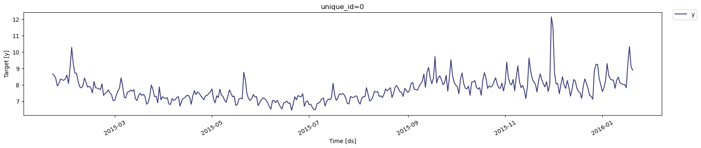
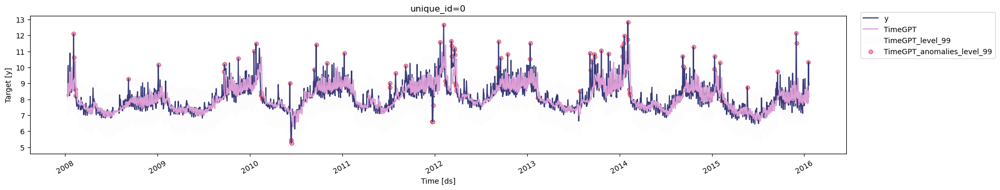
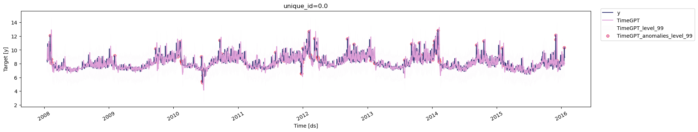
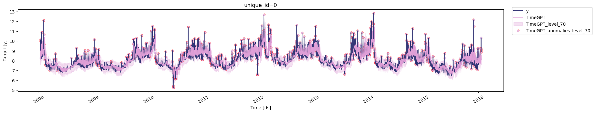

```python
!pip install -Uqq nixtla
```


```python
from nixtla.utils import in_colab
```


```python
IN_COLAB = in_colab()
```


```python
if not IN_COLAB:
    from nixtla.utils import colab_badge
    from dotenv import load_dotenv
```


Anomaly detection is task of detecting abnormal points, points that
deviate from the normal behaviour of the general series. This is crucial
in many application, such as cybersecurity or equipment monitoring.

In this tutorial, we explore in detail the anomaly detection capability
of TimeGPT.

<figure>
<a
href="https://colab.research.google.com/github/Nixtla/nixtla/blob/main/nbs/docs/tutorials/20_anomaly_detection.ipynb"></a>
</figure>

## Import packages

First, we import the required packages for this tutorial and create an
instance of `NixtlaClient`.

```python
import pandas as pd
from nixtla import NixtlaClient
```


```python
nixtla_client = NixtlaClient(
    # defaults to os.environ.get("NIXTLA_API_KEY")
    api_key = 'my_api_key_provided_by_nixtla'
)
```

> 👍 Use an Azure AI endpoint
>
> To use an Azure AI endpoint, set the `base_url` argument:
>
> `nixtla_client = NixtlaClient(base_url="you azure ai endpoint", api_key="your api_key")`


```python
if not IN_COLAB:
    nixtla_client = NixtlaClient()
```


## Load dataset

Now, let’s load the dataset for this tutorial. We use the Peyton Manning
dataset which tracks the visits to the Wikipedia page of Peyton Mannig.

```python
df = pd.read_csv('https://datasets-nixtla.s3.amazonaws.com/peyton-manning.csv')
df.head()
```

|     | unique_id | ds         | y        |
|-----|-----------|------------|----------|
| 0   | 0         | 2007-12-10 | 9.590761 |
| 1   | 0         | 2007-12-11 | 8.519590 |
| 2   | 0         | 2007-12-12 | 8.183677 |
| 3   | 0         | 2007-12-13 | 8.072467 |
| 4   | 0         | 2007-12-14 | 7.893572 |

```python
nixtla_client.plot(df, max_insample_length=365)
```



## Anomaly detection

We now perform anomaly detection. By default, TimeGPT uses a 99%
confidence interval. If a point falls outisde of that interval, it is
considered to be an anomaly.

```python
anomalies_df = nixtla_client.detect_anomalies(df, freq='D')
anomalies_df.head()
```

``` text
INFO:nixtla.nixtla_client:Validating inputs...
INFO:nixtla.nixtla_client:Querying model metadata...
INFO:nixtla.nixtla_client:Preprocessing dataframes...
INFO:nixtla.nixtla_client:Calling Anomaly Detector Endpoint...
```

|     | unique_id | ds         | y         | TimeGPT  | TimeGPT-hi-99 | TimeGPT-lo-99 | anomaly |
|-----|-----------|------------|-----------|----------|---------------|---------------|---------|
| 0   | 0         | 2008-01-10 | 8.281724  | 8.224187 | 9.503586      | 6.944788      | False   |
| 1   | 0         | 2008-01-11 | 8.292799  | 8.151533 | 9.430932      | 6.872135      | False   |
| 2   | 0         | 2008-01-12 | 8.199189  | 8.127243 | 9.406642      | 6.847845      | False   |
| 3   | 0         | 2008-01-13 | 9.996522  | 8.917259 | 10.196658     | 7.637861      | False   |
| 4   | 0         | 2008-01-14 | 10.127071 | 9.002326 | 10.281725     | 7.722928      | False   |

> 📘 Available models in Azure AI
>
> If you are using an Azure AI endpoint, please be sure to set
> `model="azureai"`:
>
> `nixtla_client.detect_anomalies(..., model="azureai")`
>
> For the public API, we support two models: `timegpt-1` and
> `timegpt-1-long-horizon`.
>
> By default, `timegpt-1` is used. Please see [this
> tutorial](https://docs.nixtla.io/docs/tutorials-long_horizon_forecasting)
> on how and when to use `timegpt-1-long-horizon`.

As you can see, `False` is assigned to “normal” values, as they fall
inside the confidence interval. A label of `True` is then assigned to
abnormal points.

We can also plot the anomalies using `NixtlaClient`.

```python
nixtla_client.plot(df, anomalies_df)
```



## Anomaly detection with exogenous features

Previously, we performed anomaly detection without using any exogenous
features. Now, it is possible to create features specifically for this
scenario to inform the model in its task of anomaly detection.

Here, we create date features that can be used by the model.

This is done using the `date_features` argument. We can set it to `True`
and it will generate all possible features from the given dates and
frequency of the data. Alternatively, we can specify a list of features
that we want. In this case, we want only features at the *month* and
*year* level.

```python
anomalies_df_x = nixtla_client.detect_anomalies(
    df,
    freq='D', 
    date_features=['month', 'year'],
    date_features_to_one_hot=True,
)
```

``` text
INFO:nixtla.nixtla_client:Validating inputs...
INFO:nixtla.nixtla_client:Preprocessing dataframes...
INFO:nixtla.nixtla_client:Using the following exogenous features: ['month_1.0', 'month_2.0', 'month_3.0', 'month_4.0', 'month_5.0', 'month_6.0', 'month_7.0', 'month_8.0', 'month_9.0', 'month_10.0', 'month_11.0', 'month_12.0', 'year_2007.0', 'year_2008.0', 'year_2009.0', 'year_2010.0', 'year_2011.0', 'year_2012.0', 'year_2013.0', 'year_2014.0', 'year_2015.0', 'year_2016.0']
INFO:nixtla.nixtla_client:Calling Anomaly Detector Endpoint...
```

Then, we can plot the detected anomalies where the model now used
additional information from exogenous features.

```python
nixtla_client.plot(df, anomalies_df_x)
```



## Modifying the confidence intervals

We can tweak the confidence intervals using the `level` argument. This
takes any values between 0 and 100, including decimal numbers.

Reducing the confidence interval resutls in more anomalies being
detected, while increasing it will reduce the number of anomalies.

Here, for example, we reduce the interval to 70%, and we will notice
more anomalies being plotted (red dots).

```python
anomalies_df = nixtla_client.detect_anomalies(
    df, 
    freq='D',
    level=70
)
```

``` text
INFO:nixtla.nixtla_client:Validating inputs...
INFO:nixtla.nixtla_client:Preprocessing dataframes...
INFO:nixtla.nixtla_client:Calling Anomaly Detector Endpoint...
```

```python
nixtla_client.plot(df, anomalies_df)
```



