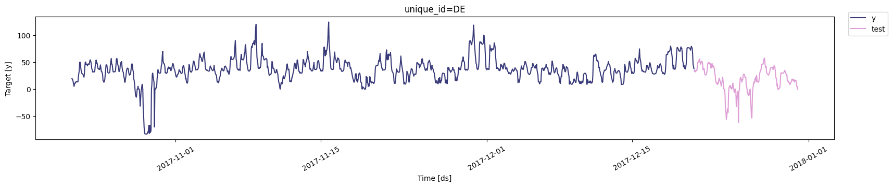
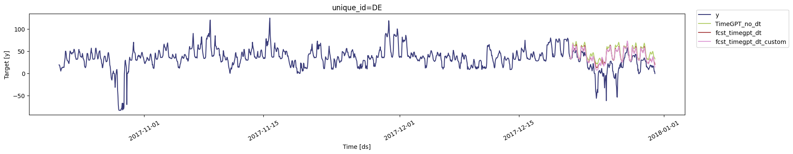

```python
!pip install -Uqq nixtla
```


```python
from nixtla.utils import in_colab
```


```python
IN_COLAB = in_colab()
```


```python
if not IN_COLAB:
    from nixtla.utils import colab_badge
    from dotenv import load_dotenv
```


Many time series display patterns that repeat based on the calendar like
demand increasing on weekends, sales peaking at the end of the month, or
traffic varying by hour of the day. Recognizing and capturing these
time-based patterns can be a powerful way to improve forecasting
accuracy.

While you can forecast a time series based solely on its historical
values, adding additional date/time related features, such as the day of
the week, month, quarter, or hour, can often enhance the model’s
performance. These features can be especially useful when your dataset
lacks exogenous variables, but they can also complement external
regressors when available.

In this tutorial, we’ll walk through how to incorporate these date/time
features into TimeGPT to boost the accuracy of your forecasts.

## How to incorporate Date/Time Features in your Forecasts

### Step 1: Import Packages

Import the necessary libraries and initialize the Nixtla client.

```python
import numpy as np
import pandas as pd
from nixtla import NixtlaClient

# For forecast evaluation
from utilsforecast.evaluation import evaluate
from utilsforecast.losses import mae, rmse
```

You can instantiate the `NixtlaClient` class providing your
authentication API key.

```python
nixtla_client = NixtlaClient(
    # defaults to os.environ.get("NIXTLA_API_KEY")
    api_key='my_api_key_provided_by_nixtla'  
)
```


```python
if not IN_COLAB:
    nixtla_client = NixtlaClient()
```


### Step 2: Load Data

In this notebook, we use hourly electricity prices as our example
dataset, which consists of 5 time series, each with approximately 1700
data points. For demonstration purposes, we focus on the German
electricity price series. The time series is split, with the last 240
steps (10 days) set aside as the test set.

For simplicity, we will also demonstrate this tutorial without the use
of any additional exogenous variables, but you could extend this same
technique for datasets that have exogenous variables.

```python
df = pd.read_csv('https://raw.githubusercontent.com/Nixtla/transfer-learning-time-series/main/datasets/electricity-short-with-ex-vars.csv')
df['ds'] = pd.to_datetime(df['ds'])
df_sub = df.query('unique_id == "DE"')[['unique_id','ds','y']]
```


```python
df_train = df_sub.query('ds < "2017-12-21"')
df_test = df_sub.query('ds >= "2017-12-21"')
df_train.shape, df_test.shape
```

``` text
((1440, 3), (240, 3))
```

```python
nixtla_client.plot(df_train, df_test.rename(columns={'y': 'test'}))
```



### Step 3: Forecasting

#### Without Datetime Features

First, we forecast the univariate time series without the use of
datetime features.

```python
fcst_timegpt_no_dt = nixtla_client.forecast(
    df = df_train,
    h=24*10,
    model="timegpt-1-long-horizon"
)
```

``` text
WARNING:nixtla.nixtla_client:The specified horizon "h" exceeds the model horizon, this may lead to less accurate forecasts. Please consider using a smaller horizon.
```

We will rename the forecast column for this approach, so that we can
distinguish it from forecasts created using other methods later.

```python
fcst_timegpt_no_dt.rename(columns={"TimeGPT": "TimeGPT_no_dt"}, inplace=True)
```

#### With Inbuilt Datetime Features

Next, let’s forecast the same univariate time series with datetime
features. This can be done by specifying the `date_features` argument.
The data is hourly, so both the hour of the day (`hour`) and the day of
the week (`dayofweek`) may impact the usage.

For example, the usage may peak in the afternoon and drop off at night.
It can also differ between the weekdays and weekends due to working and
holiday patterns. Including these features can help the model make
better forecasts.

> NOTE: 1. In order to show how these features are created, we can add
> the `feature_contribution` agrument. This is just for demonstration
> purposes in this tutorial and not truly needed to forecast with
> datetime features. 2. If you have a weekly frequency dataset, you can
> use `date_features = ["week", "month", "year"]` or a subset of these
> features. 3. If you have a monthly frequency dataset, you can use
> `date_features = ["month", "year"]` or a subset of these features.

```python
fcst_timegpt_dt_no_ohe = nixtla_client.forecast(
    df = df_train,
    h=24*10,
    model="timegpt-1-long-horizon",
    date_features=['hour', 'dayofweek'],
    feature_contributions=True
)
```

``` text
WARNING:nixtla.nixtla_client:The specified horizon "h" exceeds the model horizon, this may lead to less accurate forecasts. Please consider using a smaller horizon.
```

```python
shap_df = nixtla_client.feature_contributions
shap_df.head()
```

|     | unique_id | ds                  | TimeGPT   | hour       | dayofweek | base_value |
|-----|-----------|---------------------|-----------|------------|-----------|------------|
| 0   | DE        | 2017-12-21 00:00:00 | 34.945976 | -12.797431 | 4.236599  | 43.506810  |
| 1   | DE        | 2017-12-21 01:00:00 | 33.700954 | -14.274811 | 4.168986  | 43.806778  |
| 2   | DE        | 2017-12-21 02:00:00 | 32.120293 | -15.785894 | 4.123096  | 43.783092  |
| 3   | DE        | 2017-12-21 03:00:00 | 32.544914 | -15.623017 | 4.542475  | 43.625454  |
| 4   | DE        | 2017-12-21 04:00:00 | 33.698105 | -14.559433 | 4.525819  | 43.731720  |

As we can see, two new exogenous features (`hour` and `dayofweek`) got
added to the dataset and the forecast utilized these features.

However, we need to ensure that the model treats each hour (0, 1, 2, …,
23) and each day (0, 1, 2, …, 6) as a categorical variable and not as a
numerical variable. If treated numerically, the model may exaggerate
differences (e.g., hour 23 might appear 23 times more influential than
hour 1), which doesn’t reflect real patterns. Electricity usage at hour
23 is typically similar to hour 1, and day 6 usage often resembles day
0.

To avoid this distortion, we one-hot encode these variables using the
`date_features_to_one_hot` argument. This creates a separate exogenous
feature for each hour and each day, allowing the model to capture their
effects independently.

```python
fcst_timegpt_dt = nixtla_client.forecast(
    df = df_train,
    h=24*10,
    model="timegpt-1-long-horizon",
    date_features=['hour', 'dayofweek'],
    date_features_to_one_hot=['hour', 'dayofweek'],
    feature_contributions=True
)
```

``` text
WARNING:nixtla.nixtla_client:The specified horizon "h" exceeds the model horizon, this may lead to less accurate forecasts. Please consider using a smaller horizon.
```

```python
shap_df = nixtla_client.feature_contributions
shap_df.head()
```

|     | unique_id | ds                  | TimeGPT   | hour_0     | hour_1     | hour_2     | hour_3     | hour_4     | hour_5   | hour_6   | ... | hour_22  | hour_23  | dayofweek_0 | dayofweek_1 | dayofweek_2 | dayofweek_3 | dayofweek_4 | dayofweek_5 | dayofweek_6 | base_value |
|-----|-----------|---------------------|-----------|------------|------------|------------|------------|------------|----------|----------|-----|----------|----------|-------------|-------------|-------------|-------------|-------------|-------------|-------------|------------|
| 0   | DE        | 2017-12-21 00:00:00 | 35.248108 | -13.396377 | 0.387143   | 0.423001   | 0.392672   | 0.373034   | 0.333778 | 0.147671 | ... | 0.271507 | 0.393282 | 0.472389    | -0.377321   | -0.548429   | -0.101086   | -0.133001   | 1.455560    | 2.975230    | 44.333805  |
| 1   | DE        | 2017-12-21 01:00:00 | 34.400800 | 0.358443   | -14.488875 | 0.389985   | 0.359990   | 0.341219   | 0.320964 | 0.135058 | ... | 0.266497 | 0.391259 | 0.445456    | -0.306117   | -0.436959   | -0.172850   | -0.151865   | 1.533456    | 3.022358    | 44.539093  |
| 2   | DE        | 2017-12-21 02:00:00 | 33.175526 | 0.375983   | 0.372809   | -15.824338 | 0.348533   | 0.351379   | 0.317832 | 0.123833 | ... | 0.273698 | 0.410714 | 0.417348    | -0.279551   | -0.342991   | -0.171547   | -0.142890   | 1.532721    | 3.042772    | 44.515614  |
| 3   | DE        | 2017-12-21 03:00:00 | 33.205390 | 0.368333   | 0.366936   | 0.372584   | -15.880591 | 0.346306   | 0.319877 | 0.136488 | ... | 0.276705 | 0.416273 | 0.508190    | -0.274014   | -0.339005   | -0.176228   | -0.152890   | 1.588364    | 3.095226    | 44.391410  |
| 4   | DE        | 2017-12-21 04:00:00 | 34.689583 | 0.363581   | 0.363459   | 0.393807   | 0.362043   | -14.755774 | 0.314718 | 0.141911 | ... | 0.274819 | 0.402653 | 0.531417    | -0.277548   | -0.360688   | -0.159342   | -0.169762   | 1.692538    | 3.165733    | 44.505848  |

As we can see above, this now creates a separate feature for each hour
of the day and each day of the week.

> NOTE: With one hot encoding, the number of features can increase by a
> lot. This is especially true if you have weekly frequency data and you
> are using `date_feature=["week"]` because this leads to 52 features
> being created after one hot encoding. Please make sure that your
> dataset has enough datapoints or else the model will overfit to the
> data. You can increase the number of datapoints in the dataset by
> increasing the available history for your time series, or increasing
> the number of unique time series that share a common pattern in your
> dataset.

```python
fcst_timegpt_dt.rename(columns={"TimeGPT": "fcst_timegpt_dt"}, inplace=True)
```

#### With Custom Datetime Features

In the example above, we saw how to incorporate the inbuilt datetime
features into the forecast. However, as seen above, in some cases, it
may not be feasible to one hot encode the datetime features since it may
lead to a large number of features for the dataset size. In that case,
we can create a custom datetime feature and use it in the forecast.

In this example, we will create a sine/cosine encoder for the week which
is a popular technique to encode datetime features due to their circular
nature described above (e.g. hour 23 behavior is close to hour 0
behavior, week 52 behavior is very close to week 1 behavior, etc.).

```python
class SinCosWeekOfYear:
    """
    Adds sine and cosine features for each week of the year. This is useful for
    models that can benefit from understanding the periodicity of weeks in a year.
    """
    def __call__(self, dates: pd.DatetimeIndex):
        df = pd.DataFrame(index=dates)
        # Get week of year (1 to 53)
        weeks = np.array([date.isocalendar().week for date in dates])

        # Calculate sine and cosine features
        df["week_sin"] = np.sin((2 * np.pi) * (weeks-1) / 53).round(4)
        df["week_cos"] = np.cos((2 * np.pi) * (weeks-1) / 53).round(4)
        return df

    def __name__(self):
        return "SinCosWeekOfYear"

# Example usage
dates = pd.date_range(start='2023-01-01', periods=55, freq='W-MON')
sin_cos_week = SinCosWeekOfYear()
features = sin_cos_week(dates)
features.tail()
```

|            | week_sin | week_cos |
|------------|----------|----------|
| 2023-12-18 | -0.3482  | 0.9374   |
| 2023-12-25 | -0.2349  | 0.9720   |
| 2024-01-01 | 0.0000   | 1.0000   |
| 2024-01-08 | 0.1183   | 0.9930   |
| 2024-01-15 | 0.2349   | 0.9720   |

As we can see above, because of the cyclical encoding of the datetime
feature, the encoded values (`week_sin` and `week_cos`) for week
2023-12-25 (week 52) is very close to 2024-01-01 (week 1). This will
ensure that the learned features for week 52 will be close to those for
week 1. This has also helped us get the feature cardinality down from 53
(in case of one hot encoding) to only 2 features.

In our example, we have the hour feature wich has a relatively high
cardinality after one hot encoding. Let’s encode this with sine and
cosine features and use this instead of the one hot encoding.

```python
class SinCosHourOfDay:
    """
    Adds sine and cosine features for each hour of the day. This is useful for
    models that can benefit from understanding the periodicity of hours in a day.
    """
    def __call__(self, dates: pd.DatetimeIndex):
        df = pd.DataFrame(index=dates)
        # Get hour of day (0 to 23)
        hours = np.array([date.hour for date in dates])

        # Calculate sine and cosine features
        df["hour_sin"] = np.sin((2 * np.pi) * (hours) / 24).round(4)
        df["hour_cos"] = np.cos((2 * np.pi) * (hours) / 24).round(4)
        return df

    def __name__(self):
        return "SinCosHourOfDay"

# Example usage
dates = pd.date_range(start='2023-01-01 00:00', periods=26, freq='h')
sin_cos_hour = SinCosHourOfDay()
features = sin_cos_hour(dates)
features.tail()
```

|                     | hour_sin | hour_cos |
|---------------------|----------|----------|
| 2023-01-01 21:00:00 | -0.7071  | 0.7071   |
| 2023-01-01 22:00:00 | -0.5000  | 0.8660   |
| 2023-01-01 23:00:00 | -0.2588  | 0.9659   |
| 2023-01-02 00:00:00 | 0.0000   | 1.0000   |
| 2023-01-02 01:00:00 | 0.2588   | 0.9659   |

In order to use this custom datetime feature, we can simply pass an
instance of the class to the `date_features` argument. Since this is
alreay encoded, we do not need to include it in the
`date_features_to_one_hot` argument.

```python
fcst_timegpt_dt_custom = nixtla_client.forecast(
    df = df_train,
    h=24*10,
    model="timegpt-1-long-horizon",
    date_features=[SinCosHourOfDay(), 'dayofweek'],
    date_features_to_one_hot=['dayofweek'],
    feature_contributions=True
)
```

``` text
WARNING:nixtla.nixtla_client:The specified horizon "h" exceeds the model horizon, this may lead to less accurate forecasts. Please consider using a smaller horizon.
```

```python
shap_df = nixtla_client.feature_contributions
shap_df.head()
```

|     | unique_id | ds                  | TimeGPT   | hour_sin  | hour_cos   | dayofweek_0 | dayofweek_1 | dayofweek_2 | dayofweek_3 | dayofweek_4 | dayofweek_5 | dayofweek_6 | base_value |
|-----|-----------|---------------------|-----------|-----------|------------|-------------|-------------|-------------|-------------|-------------|-------------|-------------|------------|
| 0   | DE        | 2017-12-21 00:00:00 | 35.801600 | -3.609636 | -9.003666  | 0.805974    | -0.424078   | -0.343238   | -0.428668   | -0.055370   | 1.462214    | 3.295479    | 44.102590  |
| 1   | DE        | 2017-12-21 01:00:00 | 34.419390 | -3.824628 | -10.493365 | 0.714771    | -0.400898   | -0.282606   | -0.331269   | -0.115753   | 1.539153    | 3.245723    | 44.368263  |
| 2   | DE        | 2017-12-21 02:00:00 | 32.892105 | -4.959243 | -10.772224 | 0.712402    | -0.439891   | -0.261654   | -0.207954   | -0.191223   | 1.481960    | 3.206257    | 44.323673  |
| 3   | DE        | 2017-12-21 03:00:00 | 32.727295 | -5.161374 | -10.812295 | 0.771099    | -0.417504   | -0.262543   | -0.146066   | -0.258350   | 1.578070    | 3.268950    | 44.167310  |
| 4   | DE        | 2017-12-21 04:00:00 | 34.121994 | -3.687167 | -11.353230 | 0.846524    | -0.387008   | -0.278475   | -0.169525   | -0.255498   | 1.788180    | 3.362950    | 44.255240  |

As we can see above, the hour has now gotten encoded using the sine and
cosine features instead of the one hot encoding.

```python
fcst_timegpt_dt_custom.rename(columns={"TimeGPT": "fcst_timegpt_dt_custom"}, inplace=True)
```

### Step 4: Compare Results

#### Visual Comparison

Let’s compare the results visually first. For this, we will merge all
the forecasts together. This is why we had renamed the forecast columns
above so that we can distinguish the forecasts generated by the
different methods.

```python
all_fcst = (
    fcst_timegpt_no_dt
    .merge(
        fcst_timegpt_dt,
        on=['unique_id', 'ds'],
    )
    .merge(
        fcst_timegpt_dt_custom,
        on=['unique_id', 'ds'],
    )
)
all_fcst.head()
```

|     | unique_id | ds                  | TimeGPT_no_dt | fcst_timegpt_dt | fcst_timegpt_dt_custom |
|-----|-----------|---------------------|---------------|-----------------|------------------------|
| 0   | DE        | 2017-12-21 00:00:00 | 34.340740     | 35.248108       | 35.801600              |
| 1   | DE        | 2017-12-21 01:00:00 | 34.376488     | 34.400800       | 34.419390              |
| 2   | DE        | 2017-12-21 02:00:00 | 32.215570     | 33.175526       | 32.892105              |
| 3   | DE        | 2017-12-21 03:00:00 | 34.485695     | 33.205390       | 32.727295              |
| 4   | DE        | 2017-12-21 04:00:00 | 34.359673     | 34.689583       | 34.121994              |

```python
nixtla_client.plot(df_sub, all_fcst)
```



Visually looking at the results shows that the forecast with the
datetime features is closer to the actuals as compared to the forecast
without the datetime features.

#### Metric Comparison

Next, let’s compare the forecast with the actual data quantitatively. We
will use two common metrics - `MAE` and `RMSE` for this purpose.

```python
all_fcst_with_actuals = (
    df_test[["unique_id", "ds", "y"]]
    .merge(all_fcst, on=['unique_id', 'ds'])
)
all_fcst_with_actuals.head()
```

|     | unique_id | ds                  | y     | TimeGPT_no_dt | fcst_timegpt_dt | fcst_timegpt_dt_custom |
|-----|-----------|---------------------|-------|---------------|-----------------|------------------------|
| 0   | DE        | 2017-12-21 00:00:00 | 33.09 | 34.340740     | 35.248108       | 35.801600              |
| 1   | DE        | 2017-12-21 01:00:00 | 35.26 | 34.376488     | 34.400800       | 34.419390              |
| 2   | DE        | 2017-12-21 02:00:00 | 31.88 | 32.215570     | 33.175526       | 32.892105              |
| 3   | DE        | 2017-12-21 03:00:00 | 33.04 | 34.485695     | 33.205390       | 32.727295              |
| 4   | DE        | 2017-12-21 04:00:00 | 33.60 | 34.359673     | 34.689583       | 34.121994              |

```python
metrics = [mae, rmse]

evaluation = evaluate(
    all_fcst_with_actuals,
    metrics=metrics,
)
evaluation
```

|     | unique_id | metric | TimeGPT_no_dt | fcst_timegpt_dt | fcst_timegpt_dt_custom |
|-----|-----------|--------|---------------|-----------------|------------------------|
| 0   | DE        | mae    | 27.527012     | 21.644545       | 21.139603              |
| 1   | DE        | rmse   | 33.478168     | 28.099654       | 27.616988              |

As we can see, the addition of the datetime features improved the
forecasting metrics compared to the baseline model created without these
features.

## Conclusion

As demonstrated in this tutorial

1.  Providing datetime features to the model during forecasting can
    improve the metrics substantially.
2.  However, users must be careful of the cardinality of the features
    after datetime features have been added. If the feature cardinality
    is too large for the dataset, it may lead to overfitting.
3.  In case of high cardinality, users may consider a custom encoding
    approach as demonstrated.

