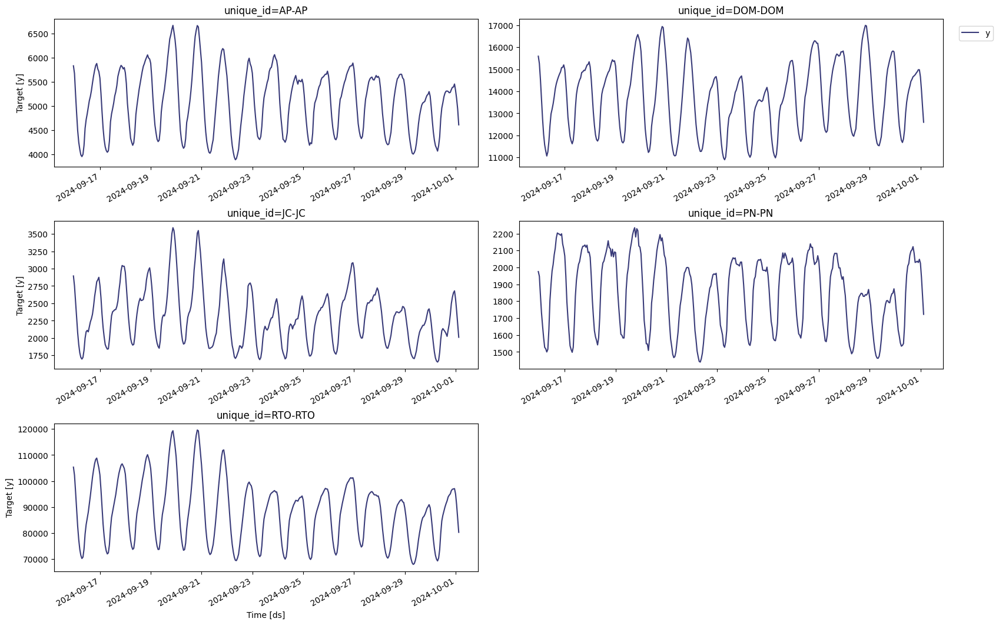
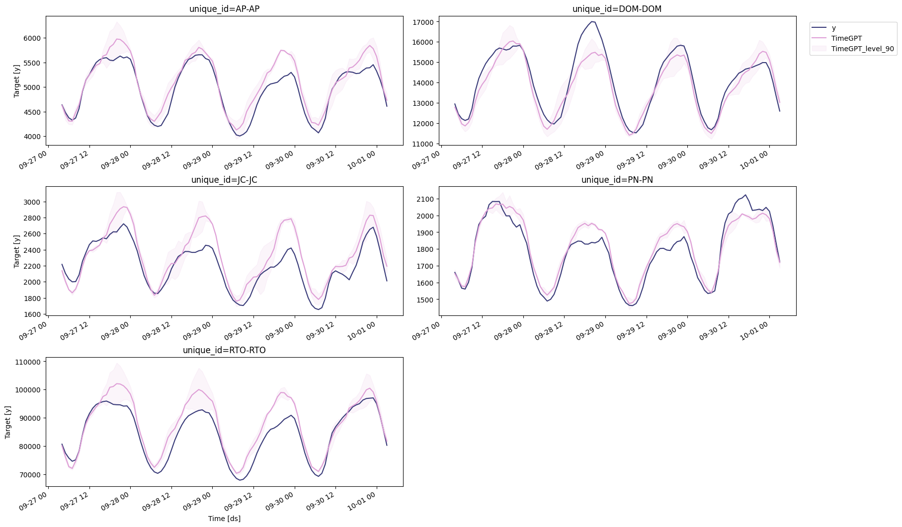

```python
!pip install -Uqq nixtla utilsforecast neuralforecast
```


```python
from nixtla.utils import in_colab
```


```python
IN_COLAB = in_colab()
```


```python
if not IN_COLAB:
    from nixtla.utils import colab_badge
    from dotenv import load_dotenv
```


This tutorial is based on an energy consumption forecasting scenario
where we make a 4-day forecast of in-zone energy consumption.

Here, we use a subset of the [PJM Hourly Energy Consumption
dataset](https://www.pjm.com/), focusing on in-zone consumption, where
electricity is both generated and consumed within the same transmission
zone. The dataset consists of hourly data from October 1, 2023, to
September 30, 2024, covering five representative areas to capture hourly
energy demand patterns.

In this experiment, we show that using TimeGPT delivers significant
improvements over using a state-of-the-art deep learning model like
N-HiTS in a just a few lines of code:

-   MAE of TimeGPT is **18.6% better** than N-HiTS
-   sMAPE of TimeGPT is **31.1% better** than N-HiTS
-   TimeGPT generated predictions in **4.3 seconds**, which is **90%
    faster** than training and predicting with N-HiTS.

The following tutorial explore all the steps in detail to reproduce
these results so that you can apply TimeGPT in your own project.

<figure>
<a
href="https://colab.research.google.com/github/Nixtla/nixtla/blob/main/nbs/docs/tutorials/3_electricity_demand.ipynb"></a>
</figure>

## Initial setup

First, we load the required packages for this experiment.

```python
import time
import requests
import pandas as pd

from nixtla import NixtlaClient

from utilsforecast.losses import mae, smape
from utilsforecast.evaluation import evaluate
```

Of course, we need an instance of `NixtlaClient` to use TimeGPT.

```python
nixtla_client = NixtlaClient(
    # defaults to os.environ.get("NIXTLA_API_KEY")
    api_key = 'my_api_key_provided_by_nixtla'
)
```

> 👍 Use an Azure AI endpoint
>
> To use an Azure AI endpoint, remember to set also the `base_url`
> argument:
>
> `nixtla_client = NixtlaClient(base_url="you azure ai endpoint", api_key="your api_key")`


```python
if not IN_COLAB:
    nixtla_client = NixtlaClient()
```


## Read the data

Here, we load in the inbound energy transmission time series.

```python
df = pd.read_csv('https://raw.githubusercontent.com/Nixtla/transfer-learning-time-series/refs/heads/main/datasets/pjm_in_zone.csv')
df['ds'] = pd.to_datetime(df['ds'])
```


```python
df.groupby('unique_id').head(2)
```

|       | unique_id | ds                        | y         |
|-------|-----------|---------------------------|-----------|
| 0     | AP-AP     | 2023-10-01 04:00:00+00:00 | 4042.513  |
| 1     | AP-AP     | 2023-10-01 05:00:00+00:00 | 3850.067  |
| 8784  | DOM-DOM   | 2023-10-01 04:00:00+00:00 | 10732.435 |
| 8785  | DOM-DOM   | 2023-10-01 05:00:00+00:00 | 10314.211 |
| 17568 | JC-JC     | 2023-10-01 04:00:00+00:00 | 1825.101  |
| 17569 | JC-JC     | 2023-10-01 05:00:00+00:00 | 1729.590  |
| 26352 | PN-PN     | 2023-10-01 04:00:00+00:00 | 1454.666  |
| 26353 | PN-PN     | 2023-10-01 05:00:00+00:00 | 1416.688  |
| 35136 | RTO-RTO   | 2023-10-01 04:00:00+00:00 | 69139.393 |
| 35137 | RTO-RTO   | 2023-10-01 05:00:00+00:00 | 66207.416 |

Let’s plot our series to see what it looks like.

```python
nixtla_client.plot(
    df, 
    max_insample_length=365, 
)
```



We can see clear sesaonal pattern in all of our series. It will be
interesting to see how TimeGPT handles this type of data.

## Forecasting with TimeGPT

### Splitting the data

The first step is to split our data. Here, we define an input DataFrame
to feed to the model. We also reserve the last 96 time steps for the
test set, so that we can evaluate the performance of TimeGPT against
actual values.

For this situation, we use a forecast horizon of 96, which represents
four days, and we use an input sequence of 362 days, which is 8688 time
steps.

```python
test_df = df.groupby('unique_id').tail(96)                                                             # 96 = 4 days (96 *  1 day/24h )

input_df = df.groupby('unique_id').apply(lambda group: group.iloc[-1104:-96]).reset_index(drop=True)   # 1008 = 42 days (1008 * 1 day/24h)
```

### Forecasting

Then, we simply call the `forecast` method. Here, we use fine-tuning and
specify the mean absolute error (MAE) as the fine-tuning loss. Also, we
use the `timegpt-1-long-horizon` since we are forecasting the next two
days, and the seasoanl period is one day.

```python
start = time.time()

fcst_df = nixtla_client.forecast(
    df=input_df,
    h=96,                            
    level=[90],                        # Generate a 90% confidence interval
    finetune_steps=10,                 # Specify the number of steps for fine-tuning
    finetune_loss='mae',               # Use the MAE as the loss function for fine-tuning
    model='timegpt-1-long-horizon',    # Use the model for long-horizon forecasting
    time_col='ds',
    target_col='y',
    id_col='unique_id'
)

end = time.time()

timegpt_duration = end - start

print(f"Time (TimeGPT): {timegpt_duration}")
```

> 📘 Available models in Azure AI
>
> If you are using an Azure AI endpoint, please be sure to set
> `model="azureai"`:
>
> `nixtla_client.forecast(..., model="azureai")`
>
> For the public API, we support two models: `timegpt-1` and
> `timegpt-1-long-horizon`.
>
> By default, `timegpt-1` is used. Please see [this
> tutorial](https://docs.nixtla.io/docs/tutorials-long_horizon_forecasting)
> on how and when to use `timegpt-1-long-horizon`.

TimeGPT was done in 4.3 seconds! We can now plot the predictions against
the actual values of the test set.

```python
nixtla_client.plot(test_df, fcst_df, models=['TimeGPT'], level=[90], time_col='ds', target_col='y')
```



### Evaluation

Now that we have predictions, let’s evaluate the model’s performance.

```python
fcst_df['ds'] = pd.to_datetime(fcst_df['ds'])

test_df = pd.merge(test_df, fcst_df, 'left', ['unique_id', 'ds'])
```


```python
evaluation = evaluate(
    test_df,
    metrics=[mae, smape],
    models=["TimeGPT"],
    target_col="y",
    id_col='unique_id'
)

average_metrics = evaluation.groupby('metric')['TimeGPT'].mean()
average_metrics
```

``` text
metric
mae      882.693979
smape      0.019974
Name: TimeGPT, dtype: float64
```

We can see that TimeGPT achieves a MAE of 882.6 and a sMAPE of 2%.

Great! Now, let’s see if a data-specific model can do better.

## Forecasting with N-HiTS

Here, we use the N-HiTS model, as it is very fast to train and performs
well on long-horizon forecasting tasks. To reproduce these results, make
sure to install the library `neuralforecast`.

```python
from neuralforecast.core import NeuralForecast
from neuralforecast.models import NHITS
```

### Define the training set

The training set is different from the input DataFrame for TimeGPT, as
we need more data to train a data-specific model.

Note that the dataset is very large, so we use the last 362 days of the
training set to fit our model.

```python
train_df = df.groupby('unique_id').apply(lambda group: group.iloc[:-96]).reset_index(drop=True)
```

### Forecasting with N-HiTS

We can now fit the model on training set and make predictions.

```python
horizon = 96

models = [NHITS(h=horizon, input_size = 5*horizon, scaler_type='robust', batch_size=16, valid_batch_size=8)]

nf = NeuralForecast(models=models, freq='H')

start = time.time()

nf.fit(df=train_df)
nhits_preds = nf.predict()

end = time.time()

nhits_duration = end - start

print(f"Time (N-HiTS): {nhits_duration}")
```

Great! Note that N-HiTS took 44 seconds to carry out the training and
forecasting procedures. Now, let’s evaluate the performance of this
model.

### Evaluation

```python
preds_df = pd.merge(test_df, nhits_preds, 'left', ['unique_id', 'ds'])

evaluation = evaluate(
    preds_df,
    metrics=[mae, smape],
    models=["NHITS"],
    target_col="y",
    id_col='unique_id'
)


average_metrics = evaluation.groupby('metric')['NHITS'].mean()
print(average_metrics)
```

## Conclusion

TimeGPT achieves a MAE of 882.6 while N-HiTS achieves a MAE of 1084.7,
meaning there is a **18.6% improvement** in using TimeGPT versus our
data-specific N-HiTS model. TimeGPT also improved the sMAPE by 31.1%.

Plus, TimeGPT took 4.3 seconds to generate forecasts, while N-HiTS took
44 seconds to fit and predict. TimeGPT is thus **90% faster** than using
N-HiTS in this scenario.


```python
# This is a test for the above last two code cells that runs faster (we train NHITS for fewer steps). It is merely here to check that the above code runs correctly.
if not IN_COLAB:
    horizon = 96

    models = [NHITS(h=horizon, input_size = 5*horizon, scaler_type='robust', batch_size=16, valid_batch_size=8, max_steps=5)]

    nf = NeuralForecast(models=models, freq='H')

    start = time.time()

    nf.fit(df=train_df)
    nhits_preds = nf.predict()

    end = time.time()

    nhits_duration = end - start

    print(f"Time (N-HiTS): {nhits_duration}")    

    preds_df = pd.merge(test_df, nhits_preds, 'left', ['unique_id', 'ds'])

    evaluation = evaluate(
        preds_df,
        metrics=[mae, smape],
        models=["NHITS"],
        target_col="y",
        id_col='unique_id'
    )

    average_metrics = evaluation.groupby('metric')['NHITS'].mean()
    print(average_metrics)
```


