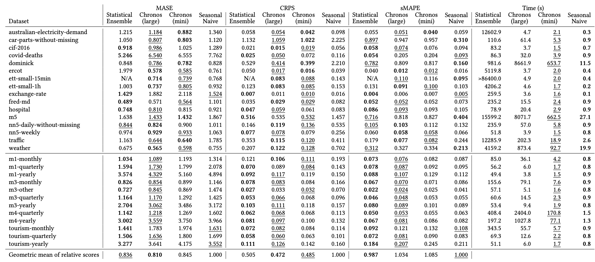

# Extended comparison of Chronos against the statistical ensemble

We present an extension to the [original comparison by Nixtla](https://github.com/Nixtla/nixtla/tree/main/experiments/amazon-chronos) of Chronos [1] against the SCUM ensemble [2]. In this analysis on over 200K unique time series across 28 datasets from Benchmark II in the Chronos paper [1], we show that **zero-shot** Chronos models perform comparably to this strong ensemble of 4 statistical models while being significantly faster on average. We follow the original study as closely as possible, including loading task definitions from GluonTS and computing metrics using utilsforecast.

## Empirical Evaluation

This study considers over 200K unique time series from Benchmark II in the Chronos paper, spanning various time series domains, frequencies, history lengths, and prediction horizons. Chronos did not use these datasets in the training phase, so this is a **zero-shot** evaluation of Chronos against the statistical ensemble fitted on these datasets. We report results for two sizes of Chronos, Large and Mini, to highlight the trade-off between forecast quality and inference speed. As in the [original benchmark](https://github.com/Nixtla/nixtla/tree/main/experiments/amazon-chronos), we have included comparisons to the seasonal naive baseline. For each model, we also report the aggregated relative score which is the geometric mean of the relative improvement over seasonal naive across datasets (see Sec. 5.4 of [1] for details). 

## Results

The CRPS, MASE, sMAPE, and inference time (in seconds) for each model across 28 datasets have been tabulated below. The best and second best results have been highlighted in **bold** and <u>underlined</u>. Note that the use of sMAPE is [discouraged by forecasting experts](https://otexts.com/fpp3/accuracy.html#percentage-errors) and we only report it here for completeness and parity with the previous benchmark.

<center>

</center>

### Notes
- The original study by Nixtla used `batch_size=8` for all Chronos models. However, on the `g5.2xlarge` instance used in the benchmark, we can safely use batch size of 16 for Chronos (large) and batch size of 64 for Chronos (mini).
- The original Nixtla benchmark re-used compiled Numba code across experiments, while this is not feasible in the current setup because of the distributed compute environment. Therefore, the reported runtime for `StatisticalEnsemble` is on average ~45 seconds higher than in the original benchmark. This does not affect the overall conclusions and the runtime ranking of `StatisticalEnsemble` and Chronos models.
- Due to differences in task definitions and metric implementations, the numbers in the above table are not directly comparable with the results reported in the Chronos paper.

## Reproducibility

### Installation
Create a virtual environment and install the dependencies

```bash
conda create -n chronos python=3.10
conda activate chronos
pip install -e .
```

### (Option 1) Running experiments locally
To evaluate a model sequentially on all 28 datasets considered in the benchmark, run the following command
```bash
python src/run_metaflow.py run --model=$MODEL_NAME --max-workers=1
```
where `$MODEL_NAME` can be one of `SeasonalNaive`, `StatisticalEnsemble`, `chronos_mini`, `chronos_small`, `chronos_base`, `chronos_large`.

We set `--max-workers=1` to ensure that each dataset is evaluated sequentially and the runtime is measured correctly.

Note that `StatisticalEnsemble` can take multiple hours to forecast for datasets with long time series and large `season_length` (e.g., ETT or ERCOT). Similarly, `chronos_large` takes a while to forecast for datasets with many individual time series (e.g., Dominick or M5). Therefore the full loop over all datasets would take more than a day.

### (Option 2) Running experiments in parallel using Metaflow
**Note that running experiments in the cloud will incur costs**

1. Configure Metaflow for parallel execution of jobs in the cloud. For example, this can be done by deploying the [Metaflow CloudFormation stack](https://github.com/Netflix/metaflow-tools/tree/master/aws/cloudformation) and [providing configuration details in `~/.metaflowconfig/config.json`](https://outerbounds.com/engineering/operations/configure-metaflow/). 

2. Uncomment lines 83-88 in `src/run_metaflow.py` to enable parallel execution on AWS Batch.

3. Build Docker image used for experiments

    ```bash
    bash build_docker.sh
    ```

4. Run the experiments using Metaflow. We use the same hardware configuration as recommended by Nixtla.

    For Chronos models, we use `g5.2xlarge` instances with a single A10G GPU
    ```bash
    python src/run_metaflow.py run --model="chronos_mini" --max-workers=28
    ```

    For StatisticalEnsemble, we use `c5a.24xlarge` instances with 96 vCPU cores
    ```bash
    BATCH_NUM_GPUS=0 BATCH_NUM_CPUS=96 BATCH_MEMORY_MB=190000 python src/run_metaflow.py run --model=StatisticalEnsemble --max-workers=28
    ```

    Make sure that the compute environment associated with your AWS Batch job queue includes the respective instance types.

    You can adjust `--max-workers` to change the number of instances running the experiments in parallel.

### Collecting the results
Run the notebook `collect_results.ipynb` to collect the results from Metaflow and compile the final results table.

### References

[1] [Chronos: Learning the Language of Time Series](https://arxiv.org/abs/2403.07815)      
[2] [A Simple Combination of Univariate Models](https://www.sciencedirect.com/science/article/abs/pii/S0169207019300585?via%3Dihub)
